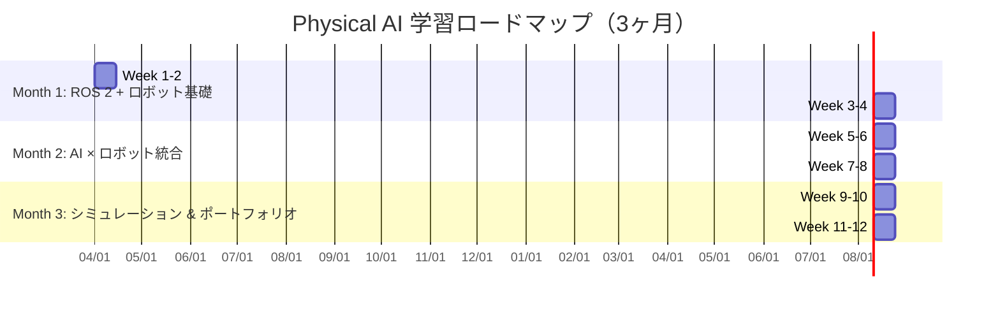
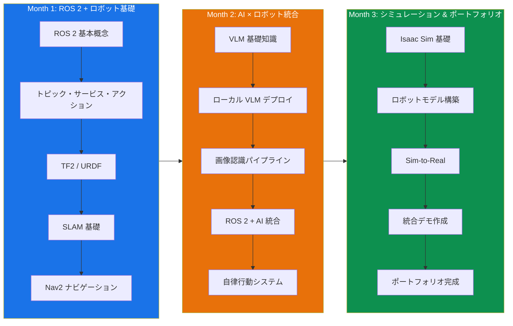
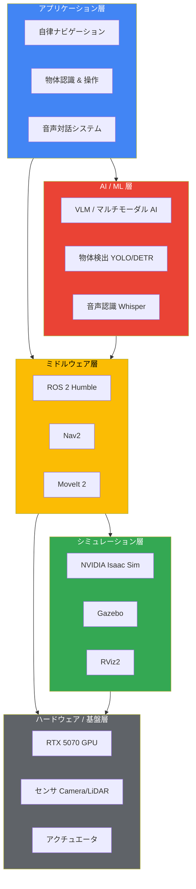
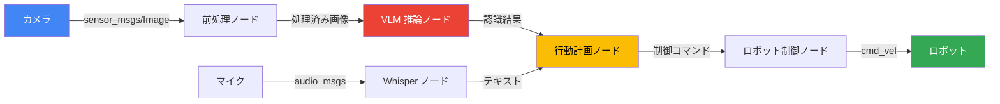
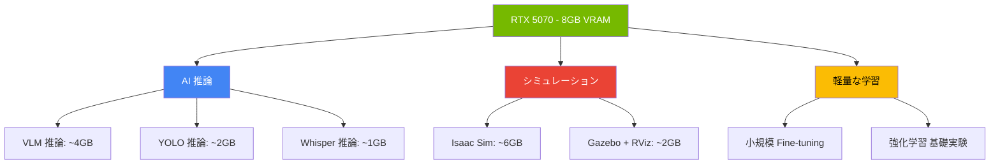

# Physical AI 学習プロジェクト

[](https://opensource.org/licenses/MIT)
[](https://docs.ros.org/en/humble/)
[](https://developer.nvidia.com/isaac-sim)
[](https://www.python.org/)

---

## 目次

1. [プロジェクト概要](#プロジェクト概要)
2. [背景と動機](#背景と動機)
3. [学習者プロフィール](#学習者プロフィール)
4. [3ヶ月ロードマップ](#3ヶ月ロードマップ)
5. [Month 1: ROS 2 + ロボット基礎](#month-1-ros-2--ロボット基礎)
6. [Month 2: AI × ロボット統合](#month-2-ai--ロボット統合)
7. [Month 3: シミュレーション & ポートフォリオ](#month-3-シミュレーション--ポートフォリオ)
8. [ディレクトリ構成](#ディレクトリ構成)
9. [開発環境](#開発環境)
10. [環境構築手順](#環境構築手順)
11. [クイックリンク](#クイックリンク)
12. [学習リソース](#学習リソース)
13. [進捗管理](#進捗管理)
14. [ライセンス](#ライセンス)

---

## プロジェクト概要

本プロジェクトは、**Physical AI（物理世界で動作するAI）** 領域のスキルを習得するための
**3ヶ月間の体系的な学習プログラム**です。

ファームウェアエンジニアとしての経験（ハードウェア制御、組込みシステム、センサ技術）を
基盤に、ロボティクスとAIの融合領域である Physical AI のスキルセットを段階的に習得します。

### 最終ゴール

3ヶ月後に以下を達成する：

1. **ROS 2 を用いたロボットシステムの構築能力**を示すポートフォリオの完成
2. **AI（VLM/マルチモーダルAI）とロボットの統合パイプライン**の実装経験
3. **NVIDIA Isaac Sim** によるシミュレーション環境の構築・活用スキル
4. **Physical AI エンジニアとしてのポートフォリオ**の完成

---

## 背景と動機

### Physical AI とは

**Physical AI** は、NVIDIA CEO ジェンスン・フアン（Jensen Huang）が
**CES 2025** の基調講演で提唱した概念です。

> "The next frontier of AI is Physical AI — AI that understands and interacts
> with the physical world."
>
> — Jensen Huang, CES 2025

Physical AI は以下の要素を統合する技術領域です：

| 要素 | 説明 |
|------|------|
| **認知（Perception）** | カメラ・LiDAR・センサによる環境理解 |
| **推論（Reasoning）** | 大規模言語モデル・VLM による意思決定 |
| **行動（Action）** | ロボットアームや移動ロボットの物理的動作 |
| **シミュレーション** | デジタルツインによる学習・検証 |

### なぜ今 Physical AI なのか

- NVIDIA が Isaac プラットフォームに巨額投資、エコシステムが急速に成熟
- Humanoid ロボット、自律移動ロボット（AMR）、産業用ロボットの市場拡大
- LLM/VLM の進化により、ロボットの知能レベルが飛躍的に向上
- 日本国内でも Physical AI スタートアップが台頭

### ファームウェアエンジニアの強み

ファームウェアエンジニアとしての経験は、Physical AI 領域で大きな差別化要因となります：

- **ハードウェアとソフトウェアの境界を理解** — センサ・アクチュエータの物理特性に精通
- **リアルタイム制御の知見** — RTOS、割り込み処理、タイミング制約への対応力
- **低レベルプログラミング** — C/C++ によるパフォーマンス最適化
- **電子回路設計** — センサ回路、電源設計、EMC 対策の実務経験

---

## 学習者プロフィール

### 基本情報

| 項目 | 内容 |
|------|------|
| **経験年数** | ファームウェアエンジニア |
| **専門領域** | 組込みシステム、ファームウェア開発 |

### 技術スタック

#### ハードウェア・組込み

- **プログラミング言語**: C / C++
- **マイコン**: ARM Cortex-M シリーズ, ESP32, STM32
- **RTOS**: FreeRTOS, Zephyr
- **回路設計**: KiCad による基板設計（回路図・PCB レイアウト）
- **通信プロトコル**: UART, SPI, I2C, CAN, BLE, Wi-Fi
- **センサ技術**: IMU, ToF, 環境センサ, 画像センサ

#### ソフトウェア・AI

- **ローカル LLM デプロイ**: llama.cpp, Ollama, vLLM の構築経験
- **Python**: データ処理、自動化スクリプト
- **Linux**: Ubuntu 環境での開発経験
- **Git**: チーム開発でのバージョン管理

#### これから習得する技術

- **ROS 2** — ロボットミドルウェア
- **SLAM / Navigation** — 自己位置推定と経路計画
- **VLM（Vision-Language Model）** — マルチモーダル AI
- **NVIDIA Isaac Sim** — ロボットシミュレーション
- **Gazebo** — オープンソースシミュレータ

---

## 3ヶ月ロードマップ

### 全体像



### フェーズ構成図



### 技術スタック全体像



---

## Month 1: ROS 2 + ロボット基礎

### 概要

最初の1ヶ月は、ロボット開発の基盤となる **ROS 2（Robot Operating System 2）** の
基本概念と、**SLAM / Navigation** の基礎を学びます。

### Week 1-2: ROS 2 入門

#### 学習目標

- ROS 2 の基本アーキテクチャを理解する
- ノード、トピック、サービス、アクションの概念と実装を習得する
- ROS 2 パッケージの作成と管理ができるようになる
- TF2（座標変換）と URDF（ロボットモデル記述）を理解する

#### 学習内容

| 日程 | テーマ | 内容 |
|------|--------|------|
| Day 1-2 | 環境構築 | WSL2 + Ubuntu 22.04 に ROS 2 Humble をインストール |
| Day 3-4 | 基本概念 | ノード、トピック、Publisher/Subscriber |
| Day 5-6 | 通信パターン | サービス（Request/Response）、アクション |
| Day 7-8 | パッケージ | ament_cmake / ament_python によるパッケージ作成 |
| Day 9-10 | 可視化 | RViz2 によるデータ可視化、rqt ツール群 |
| Day 11-12 | ロボットモデル | URDF / xacro によるロボットモデル記述 |
| Day 13-14 | TF2 | 座標変換フレームワーク、static/dynamic TF |

#### 成果物

- [ ] ROS 2 基本ノードの実装（Python / C++）
- [ ] カスタムメッセージ・サービスの定義と実装
- [ ] URDF による簡易ロボットモデルの作成
- [ ] TF2 を用いた座標変換の実装

### Week 3-4: SLAM & Navigation

#### 学習目標

- SLAM（Simultaneous Localization and Mapping）の原理を理解する
- Nav2（Navigation 2）スタックの構成と設定を習得する
- シミュレーション環境で自律ナビゲーションを実現する

#### 学習内容

| 日程 | テーマ | 内容 |
|------|--------|------|
| Day 15-16 | SLAM 理論 | 確率的手法、パーティクルフィルタ、グラフベース SLAM |
| Day 17-18 | SLAM 実装 | slam_toolbox / cartographer による地図生成 |
| Day 19-20 | Nav2 基礎 | Navigation 2 アーキテクチャ、Behavior Tree |
| Day 21-22 | コストマップ | Global/Local Costmap の設定とチューニング |
| Day 23-24 | 経路計画 | Global Planner、Local Planner (DWB/MPPI) |
| Day 25-26 | 障害物回避 | 動的障害物の検出と回避行動 |
| Day 27-28 | 統合テスト | Gazebo シミュレーションでの自律走行デモ |

#### 成果物

- [ ] SLAM による環境地図の生成
- [ ] Nav2 を使った自律ナビゲーションの実装
- [ ] Gazebo シミュレーション環境の構築
- [ ] パラメータチューニングのドキュメント

### 詳細ドキュメント

- [Month 1 詳細学習計画](./month1-ros2-basics/)
- [ROS 2 環境構築ガイド](./docs/)

---

## Month 2: AI × ロボット統合

### 概要

2ヶ月目は、**マルチモーダル AI（VLM: Vision-Language Model）** の活用と、
**ROS 2 との統合パイプライン**の構築に取り組みます。

ファームウェアエンジニアとしてのローカル LLM デプロイ経験を活かし、
エッジデバイス上での効率的な AI 推論パイプラインを構築します。

### Week 5-6: マルチモーダル AI / VLM

#### 学習目標

- VLM（Vision-Language Model）の基本原理を理解する
- ローカル環境での VLM デプロイと推論を実践する
- 物体検出・認識パイプラインを構築する
- RTX 5070 の 8GB VRAM 制約下での最適化手法を習得する

#### 学習内容

| 日程 | テーマ | 内容 |
|------|--------|------|
| Day 1-2 | VLM 概要 | CLIP, LLaVA, Florence-2 などのアーキテクチャ理解 |
| Day 3-4 | ローカルデプロイ | llama.cpp / Ollama での VLM 実行環境構築 |
| Day 5-6 | 量子化・最適化 | GGUF 量子化、TensorRT による高速化 |
| Day 7-8 | 物体検出 | YOLO v8/v9, RT-DETR のデプロイと評価 |
| Day 9-10 | 画像キャプション | VLM による画像説明生成、シーン理解 |
| Day 11-12 | プロンプト設計 | ロボット制御向けプロンプトエンジニアリング |
| Day 13-14 | ベンチマーク | 推論速度・精度の測定と最適化 |

#### VRAM 制約への対応戦略

RTX 5070 の **8GB VRAM** という制約に対して、以下の戦略で対応します：

```
┌─────────────────────────────────────────────────┐
│          VRAM 最適化戦略 (8GB)                   │
├─────────────────────────────────────────────────┤
│                                                  │
│  1. 量子化 (Quantization)                        │
│     ├── GGUF Q4_K_M: ~4GB で 7B モデル動作      │
│     ├── AWQ / GPTQ: 4-bit 量子化                │
│     └── INT8 TensorRT: 推論速度 2-3x 向上       │
│                                                  │
│  2. モデル選定                                    │
│     ├── 小型 VLM: LLaVA-1.6-7B, Florence-2     │
│     ├── 物体検出: YOLOv8n/s (軽量モデル)        │
│     └── Phi-3-Vision (3.8B パラメータ)          │
│                                                  │
│  3. 推論最適化                                    │
│     ├── TensorRT 変換による高速化                │
│     ├── バッチサイズ最適化                        │
│     └── CPU/GPU オフロード戦略                   │
│                                                  │
└─────────────────────────────────────────────────┘
```

#### 成果物

- [ ] VLM のローカルデプロイ環境構築
- [ ] 物体検出パイプラインの実装
- [ ] VRAM 最適化のベンチマークレポート
- [ ] 画像認識 API サーバーの構築

### Week 7-8: ROS 2 + AI パイプライン

#### 学習目標

- AI モデルを ROS 2 ノードとして統合する
- カメラ画像の取得から AI 推論、ロボット制御までのパイプラインを構築する
- リアルタイム処理のための最適化を実施する

#### 学習内容

| 日程 | テーマ | 内容 |
|------|--------|------|
| Day 15-16 | カメラ連携 | ROS 2 カメラノード、Image Transport |
| Day 17-18 | AI ノード | AI 推論を行う ROS 2 ノードの実装 |
| Day 19-20 | パイプライン | 認識 → 判断 → 制御のデータフロー構築 |
| Day 21-22 | 最適化 | レイテンシ最適化、非同期処理 |
| Day 23-24 | 音声対話 | Whisper + VLM による音声指示理解 |
| Day 25-26 | 行動計画 | VLM ベースのタスクプランニング |
| Day 27-28 | 統合テスト | 全体パイプラインの統合と評価 |

#### パイプライン構成図



#### 成果物

- [ ] AI 推論 ROS 2 ノードの実装
- [ ] カメラ → AI → 制御のパイプライン構築
- [ ] 音声対話機能の実装
- [ ] 統合デモの動画記録

### 詳細ドキュメント

- [Month 2 詳細学習計画](./month2-ai-robot-integration/)
- [VLM デプロイガイド](./docs/)

---

## Month 3: シミュレーション & ポートフォリオ

### 概要

最終月は、**NVIDIA Isaac Sim** によるシミュレーション環境の構築と、
3ヶ月間の学習成果を統合した**ポートフォリオの作成**に取り組みます。

### Week 9-10: Isaac Sim

#### 学習目標

- NVIDIA Isaac Sim の基本操作とワークフローを習得する
- シミュレーション環境でのロボットモデル構築を行う
- Sim-to-Real（シミュレーションから実機への転移）の概念を理解する
- Isaac Sim と ROS 2 の連携を実現する

#### 学習内容

| 日程 | テーマ | 内容 |
|------|--------|------|
| Day 1-2 | 環境構築 | Isaac Sim インストール、基本操作 |
| Day 3-4 | シーン構築 | USD ベースのシーン構築、物理設定 |
| Day 5-6 | ロボットモデル | URDF → USD 変換、関節制御 |
| Day 7-8 | センサシミュレーション | カメラ、LiDAR、IMU のシミュレーション |
| Day 9-10 | ROS 2 連携 | Isaac Sim ↔ ROS 2 Bridge の構築 |
| Day 11-12 | 強化学習基礎 | Isaac Gym / Orbit によるロボット学習 |
| Day 13-14 | Sim-to-Real | ドメインランダマイゼーション、転移学習 |

#### Isaac Sim システム要件との対応

```
開発環境:
├── GPU: RTX 5070 (8GB VRAM)
│   ├── Isaac Sim 最小要件: RTX 2070 以上 → ✅ 対応
│   ├── 推奨 VRAM: 8GB 以上 → ✅ ギリギリ対応
│   └── 注意: 大規模シーンではメモリ管理が重要
│
├── CPU: Intel Core Ultra 9 275HX
│   ├── 高性能 CPU → ✅ 十分な性能
│   └── マルチスレッド処理に有利
│
├── RAM: 十分なメモリ確保が必要
│   └── 推奨: 32GB 以上
│
└── OS: Windows 11 (ネイティブ) or WSL2
    ├── Isaac Sim: Windows ネイティブ推奨
    └── ROS 2: WSL2 (Ubuntu 22.04) で実行
```

#### 成果物

- [ ] Isaac Sim 環境の構築
- [ ] シミュレーション用ロボットモデルの作成
- [ ] Isaac Sim ↔ ROS 2 連携の実装
- [ ] シミュレーション環境でのナビゲーションデモ

### Week 11-12: ポートフォリオ作成

#### 学習目標

- 3ヶ月間の学習成果を統合したデモシステムを構築する
- 技術的な成果をわかりやすくドキュメント化する
- Physical AI エンジニアとしてのポートフォリオを完成させる

#### ポートフォリオ構成

```
ポートフォリオ
├── 1. 技術デモ
│   ├── 自律ナビゲーション（ROS 2 + Nav2）
│   ├── AI 物体認識（VLM + YOLO）
│   ├── 音声対話ロボット（Whisper + VLM + ROS 2）
│   └── Isaac Sim シミュレーション
│
├── 2. GitHub リポジトリ
│   ├── きれいなコードと包括的な README
│   ├── CI/CD パイプライン
│   └── Docker 環境
│
├── 3. 技術ブログ / ドキュメント
│   ├── 学習過程の記録
│   ├── 技術的な深掘り記事
│   └── トラブルシューティング集
│
└── 4. デモ動画
    ├── YouTube / Vimeo にアップロード
    ├── 各機能の動作デモ
    └── 統合システムの全体デモ
```

#### 成果物

- [ ] 統合デモシステムの完成
- [ ] GitHub リポジトリの整備
- [ ] 技術ブログ記事の執筆
- [ ] デモ動画の作成
- [ ] スキルシートの更新

### 詳細ドキュメント

- [Month 3 詳細学習計画](./month3-simulation-portfolio/)

---

## ディレクトリ構成

```
learning-physical-ai/
├── README.md                          # 本ファイル（プロジェクト全体の説明）
├── LICENSE                            # MIT ライセンス
├── .gitignore                         # Git 除外設定
│
├── docs/                              # 共通ドキュメント
│   ├── environment-setup.md           # 環境構築手順
│   ├── wsl2-setup.md                  # WSL2 セットアップ
│   ├── ros2-install.md                # ROS 2 インストール
│   └── troubleshooting.md             # トラブルシューティング
│
├── month1-ros2-basics/                # Month 1: ROS 2 + ロボット基礎
│   ├── README.md                      # Month 1 の学習計画
│   ├── week1-2-ros2-intro/            # Week 1-2: ROS 2 入門
│   │   ├── ros2_ws/                   # ROS 2 ワークスペース
│   │   │   └── src/                   # パッケージソース
│   │   ├── exercises/                 # 演習コード
│   │   └── notes/                     # 学習メモ
│   └── week3-4-slam-navigation/       # Week 3-4: SLAM & ナビゲーション
│       ├── ros2_ws/                   # ROS 2 ワークスペース
│       ├── maps/                      # SLAM で生成した地図
│       └── config/                    # Nav2 設定ファイル
│
├── month2-ai-robot-integration/       # Month 2: AI × ロボット統合
│   ├── README.md                      # Month 2 の学習計画
│   ├── week5-6-multimodal-ai/         # Week 5-6: マルチモーダル AI
│   │   ├── models/                    # AI モデル（.gitignore 対象）
│   │   ├── notebooks/                 # Jupyter ノートブック
│   │   ├── scripts/                   # 推論スクリプト
│   │   └── benchmarks/               # ベンチマーク結果
│   └── week7-8-ros2-ai-pipeline/      # Week 7-8: ROS 2 + AI パイプライン
│       ├── ros2_ws/                   # ROS 2 ワークスペース
│       ├── launch/                    # Launch ファイル
│       └── config/                    # 設定ファイル
│
├── month3-simulation-portfolio/       # Month 3: シミュレーション & ポートフォリオ
│   ├── README.md                      # Month 3 の学習計画
│   ├── week9-10-isaac-sim/            # Week 9-10: Isaac Sim
│   │   ├── scenes/                    # USD シーンファイル
│   │   ├── robots/                    # ロボットモデル
│   │   └── scripts/                   # Isaac Sim スクリプト
│   └── week11-12-portfolio/           # Week 11-12: ポートフォリオ
│       ├── demo/                      # 統合デモ
│       ├── docs/                      # ポートフォリオドキュメント
│       └── videos/                    # デモ動画（リンクのみ）
│
└── scripts/                           # ユーティリティスクリプト
    ├── setup-env.sh                   # 環境セットアップスクリプト
    ├── install-ros2.sh                # ROS 2 インストールスクリプト
    └── download-models.sh             # AI モデルダウンロードスクリプト
```

---

## 開発環境

### ハードウェア

| コンポーネント | スペック | 備考 |
|--------------|---------|------|
| **CPU** | Intel Core Ultra 9 275HX | 最新世代、高性能マルチスレッド |
| **GPU** | NVIDIA GeForce RTX 5070 | 8GB VRAM、CUDA / TensorRT 対応 |
| **RAM** | — | 32GB 以上推奨 |
| **Storage** | — | SSD 推奨、100GB 以上の空き容量 |

### ソフトウェア

| カテゴリ | ツール | バージョン |
|---------|--------|-----------|
| **OS** | Windows 11 Home | 10.0.26200 |
| **仮想化** | WSL2 + Ubuntu 22.04 LTS | — |
| **ロボット** | ROS 2 Humble Hawksbill | LTS (〜2027) |
| **シミュレータ** | NVIDIA Isaac Sim | 2023.1.1+ |
| **シミュレータ** | Gazebo (Ignition) | Fortress |
| **GPU ドライバ** | NVIDIA Driver | 550+ |
| **CUDA** | CUDA Toolkit | 12.x |
| **Python** | Python | 3.10+ |
| **コンテナ** | Docker Desktop + WSL2 | — |
| **エディタ** | VS Code + Remote WSL | — |

### GPU 活用方針



> **注意**: 8GB VRAM の制約により、AI 推論とシミュレーションの同時実行は困難です。
> タスクに応じて GPU リソースを切り替えて使用します。

---

## 環境構築手順

### 前提条件

1. Windows 11 がインストールされていること
2. NVIDIA GPU ドライバが最新であること
3. WSL2 が有効化されていること

### ステップ 1: WSL2 + Ubuntu 22.04 のセットアップ

```bash
# WSL2 のインストール（管理者権限の PowerShell）
wsl --install -d Ubuntu-22.04

# Ubuntu の更新
sudo apt update && sudo apt upgrade -y
```

### ステップ 2: CUDA Toolkit のインストール（WSL2 内）

```bash
# NVIDIA CUDA Toolkit for WSL2
# 参照: https://developer.nvidia.com/cuda-downloads

# GPU の確認
nvidia-smi
```

### ステップ 3: ROS 2 Humble のインストール

```bash
# ロケール設定
sudo apt install locales
sudo locale-gen en_US en_US.UTF-8
sudo update-locale LC_ALL=en_US.UTF-8 LANG=en_US.UTF-8
export LANG=en_US.UTF-8

# ROS 2 リポジトリの追加
sudo apt install software-properties-common
sudo add-apt-repository universe
sudo apt update && sudo apt install curl -y
sudo curl -sSL https://raw.githubusercontent.com/ros/rosdistro/master/ros.key \
  -o /usr/share/keyrings/ros-archive-keyring.gpg
echo "deb [arch=$(dpkg --print-architecture) signed-by=/usr/share/keyrings/ros-archive-keyring.gpg] \
  http://packages.ros.org/ros2/ubuntu $(. /etc/os-release && echo $UBUNTU_CODENAME) main" \
  | sudo tee /etc/apt/sources.list.d/ros2.list > /dev/null

# ROS 2 Humble Desktop のインストール
sudo apt update
sudo apt install ros-humble-desktop -y

# 環境設定
echo "source /opt/ros/humble/setup.bash" >> ~/.bashrc
source ~/.bashrc
```

### ステップ 4: Python 環境のセットアップ

```bash
# Python 仮想環境
python3 -m venv ~/.venvs/physical-ai
source ~/.venvs/physical-ai/bin/activate

# 基本パッケージ
pip install --upgrade pip
pip install numpy opencv-python-headless matplotlib jupyter
pip install torch torchvision torchaudio --index-url https://download.pytorch.org/whl/cu121
```

### ステップ 5: 開発ツールのインストール

```bash
# colcon ビルドツール
sudo apt install python3-colcon-common-extensions -y

# 追加 ROS 2 パッケージ
sudo apt install ros-humble-navigation2 ros-humble-nav2-bringup -y
sudo apt install ros-humble-slam-toolbox -y
sudo apt install ros-humble-gazebo-ros-pkgs -y

# 開発用ツール
sudo apt install ros-humble-rqt* -y
```

### 詳細な環境構築ガイド

より詳細な手順は [docs/](./docs/) ディレクトリを参照してください。

---

## クイックリンク

### 月別学習計画

| 月 | テーマ | リンク |
|----|--------|--------|
| **Month 1** | ROS 2 + ロボット基礎 | [month1-ros2-basics/](./month1-ros2-basics/) |
| **Month 2** | AI × ロボット統合 | [month2-ai-robot-integration/](./month2-ai-robot-integration/) |
| **Month 3** | シミュレーション & ポートフォリオ | [month3-simulation-portfolio/](./month3-simulation-portfolio/) |

### ドキュメント

| ドキュメント | 説明 | リンク |
|------------|------|--------|
| 環境構築 | 開発環境のセットアップ手順 | [docs/](./docs/) |
| スクリプト | ユーティリティスクリプト集 | [scripts/](./scripts/) |

### 外部リソース

| リソース | リンク |
|---------|--------|
| ROS 2 公式ドキュメント | [https://docs.ros.org/en/humble/](https://docs.ros.org/en/humble/) |
| NVIDIA Isaac Sim | [https://developer.nvidia.com/isaac-sim](https://developer.nvidia.com/isaac-sim) |
| Nav2 ドキュメント | [https://docs.nav2.org/](https://docs.nav2.org/) |
| MoveIt 2 | [https://moveit.ros.org/](https://moveit.ros.org/) |
| Gazebo | [https://gazebosim.org/](https://gazebosim.org/) |

---

## 学習リソース

### 書籍

| タイトル | 著者 | 備考 |
|---------|------|------|
| ROS 2 で作るロボットプログラミング | — | ROS 2 入門に最適 |
| 確率ロボティクス | S. Thrun 他 | SLAM / Navigation の理論 |
| ロボティクスの基礎 | — | ロボット工学の基本 |

### オンラインコース

| コース名 | プラットフォーム | 備考 |
|---------|----------------|------|
| ROS 2 for Beginners | Udemy | ROS 2 入門 |
| Self-Driving Cars Specialization | Coursera | 自律走行の理論 |
| NVIDIA DLI: Isaac Sim | NVIDIA | Isaac Sim 公式トレーニング |

### コミュニティ

| コミュニティ | リンク | 備考 |
|------------|--------|------|
| ROS Discourse | [discourse.ros.org](https://discourse.ros.org/) | ROS 公式フォーラム |
| NVIDIA Developer Forums | [forums.developer.nvidia.com](https://forums.developer.nvidia.com/) | Isaac 関連 |
| ROS Japan Users Group | — | 日本語コミュニティ |

---

## 進捗管理

### 進捗トラッキング方法

1. **GitHub Issues** — 各週の学習タスクを Issue として管理
2. **GitHub Projects** — カンバンボードで進捗を可視化
3. **学習ログ** — 日々の学習内容を記録

### マイルストーン

| マイルストーン | 期限 | 状態 |
|-------------|------|------|
| M1: ROS 2 環境構築完了 | Week 1 | 未着手 |
| M2: ROS 2 基本操作習得 | Week 2 | 未着手 |
| M3: SLAM デモ完成 | Week 4 | 未着手 |
| M4: VLM ローカルデプロイ | Week 6 | 未着手 |
| M5: AI + ROS 2 パイプライン | Week 8 | 未着手 |
| M6: Isaac Sim 連携 | Week 10 | 未着手 |
| M7: ポートフォリオ完成 | Week 12 | 未着手 |

### 週次振り返りテンプレート

```markdown
## Week X 振り返り

### 今週やったこと
-

### 学んだこと
-

### 困ったこと・課題
-

### 来週の予定
-

### 所感
-
```

---

## ライセンス

本プロジェクトは [MIT License](./LICENSE) のもとで公開されています。

---

## 謝辞

- **NVIDIA** — Isaac Sim、CUDA、TensorRT などの開発ツール提供
- **Open Robotics** — ROS 2 エコシステムの開発・維持
- **ROS コミュニティ** — 豊富なドキュメントとパッケージ群


---

> **注記**: 本プロジェクトは個人の学習目的で作成されています。
> 記載されている企業名・製品名は各社の商標または登録商標です。

---

*最終更新: 2025年*
