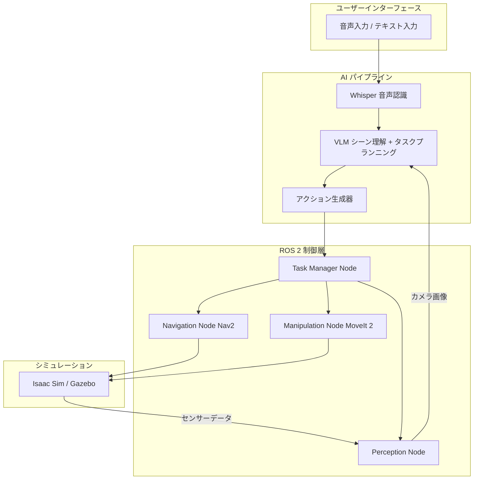

# ポートフォリオ構築計画

> Physical AI 領域でのスキルを実践的に証明するための戦略的ポートフォリオ構築計画書。
> ファームウェアエンジニアとしてのバックグラウンドを活かし、Physical AI 領域での実装力を示すことを目指す。

---

## 目次

1. [ポートフォリオの全体戦略](#1-ポートフォリオの全体戦略)
2. [メインプロジェクト要件定義](#2-メインプロジェクト要件定義)
3. [技術的な差別化ポイント](#3-技術的な差別化ポイント)
4. [デモ動画の構成案](#4-デモ動画の構成案)
5. [GitHub リポジトリの見せ方](#5-github-リポジトリの見せ方)
6. [技術ブログでの発信計画](#6-技術ブログでの発信計画)
7. [スキルの実践的な証明](#7-スキルの実践的な証明)

---

## 1. ポートフォリオの全体戦略

### 1.1 ターゲット企業

Physical AI / Embodied AI 領域のスタートアップ・企業全般:
- **技術スタック（共通）:** ROS 2、マルチモーダルAI/VLM、Isaac Sim、カスタムアクチュエータ・センサー
- **求める人物像:** HW/SW両方を理解、AI×ロボティクスの橋渡し、スタートアップでの自走能力
- **国内例:** Preferred Robotics, Telexistence 等
- **海外例:** Boston Dynamics AI Institute, Figure AI, 1X Technologies

### 1.2 ユニークポジショニング

**コンセプト:** 「ハードウェア x ファームウェアのベテランが、AI x ロボティクスに進化した」

強力な理由：
1. **希少性:** AIからロボティクスへの参入者は多いが、ファームウェアからは少ない
2. **深い理解:** ハードウェアの制約や特性を肌感覚で理解
3. **実装力:** 理論だけでなく実際にモノを動かせる
4. **最適化能力:** リソース制約下でのパフォーマンス最適化に長けている

#### 技術的な強みの例

**精密制御・組込みシステム経験**
- 高精度リアルタイム制御
- 画像処理パイプライン
- 大規模組み込みシステム設計、品質要求の厳しい開発プロセス

**IoTデバイス開発経験**
- バッテリー最適化
- BLE通信プロトコル設計、IoTデバイス量産設計
- 少人数チーム開発

**個人プロジェクト**
- KiCad カスタム基板設計 → ロボット用センサーボードへ応用
- SBC での Local LLM デプロイ → エッジAI推論経験
- GAS/BigQuery/Slack 自動化 → ソフトウェアエンジニアリング

### 1.3 ポートフォリオ構成

```
ポートフォリオ全体像
├── メインプロジェクト（VLM + ROS 2 ロボット）  ← 最重要
├── サブプロジェクト群
│   ├── カスタムセンサーボード（KiCad）
│   ├── Edge AI 推論最適化デモ
│   └── micro-ROS センサーノード
├── 技術ブログ記事シリーズ（8〜10記事）
├── デモ動画（3〜5分）
└── GitHub プロフィール・README
```

---

## 2. メインプロジェクト要件定義

### 2.1 プロジェクト概要

**名称:** VLM-Guided ROS 2 Robot with Natural Language Instructions

**コンセプト:** 自然言語指示に基づき、シミュレーション環境内のロボットが物体操作やナビゲーションを実行

**タスク例:**
- 「赤いカップをテーブルからキッチンカウンターに移動して」
- 「部屋を一周して、椅子の数を教えて」

### 2.2 システムアーキテクチャ



### 2.3 ROS 2 ノードとインターフェース

#### ノード一覧

| ノード名 | 役割 | 言語 | 優先度 |
|---|---|---|---|
| `vlm_inference_node` | VLM画像理解・タスク生成 | Python | 最高 |
| `task_manager_node` | タスク分解・管理・状態遷移 | Python | 最高 |
| `navigation_node` | Nav2自律ナビゲーション | Python | 高 |
| `manipulation_node` | MoveIt 2物体操作 | Python/C++ | 高 |
| `perception_node` | カメラ画像前処理・物体検出 | Python | 高 |
| `speech_input_node` | Whisper音声認識 | Python | 中 |
| `status_monitor_node` | システム状態監視 | Python | 中 |

#### 主要トピック・サービス

```yaml
# トピック
/camera/image_raw:       sensor_msgs/msg/Image      # カメラ画像
/vlm/scene_description:  std_msgs/msg/String         # VLM環境理解結果
/task/command:           custom_msgs/msg/TaskCommand  # タスクコマンド
/navigation/goal:        geometry_msgs/msg/PoseStamped # ナビゲーションゴール
/speech/text:            std_msgs/msg/String          # 音声入力テキスト

# サービス
/vlm/query:   {image, prompt} → {answer, confidence}   # VLM問い合わせ
/task/execute: {task_description, priority} → {accepted, task_id}
```

### 2.4 使用AIモデル

| モデル | 用途 | 選定理由 |
|---|---|---|
| Florence-2-large | メインVLM | 軽量・多機能・Jetson対応 |
| LLaVA-v1.6-7B | バックアップVLM | 高い言語理解力 |
| Whisper-small | 音声認識 | 日本語対応・低レイテンシ |
| YOLOv8 | 物体検出（補助） | リアルタイム・ROS 2統合容易 |

### 2.5 パフォーマンス目標

| 指標 | 目標値 |
|---|---|
| VLM推論レイテンシ | < 2秒(GPU) / < 5秒(Jetson) |
| 音声認識レイテンシ | < 1秒 |
| ナビゲーション成功率 | > 90% |
| 物体把持成功率 | > 70% |
| エンドツーエンド成功率 | > 60% |

### 2.6 ハードウェア要件

- **開発:** RTX 3060+, 32GB RAM, Ubuntu 22.04
- **Edge（将来）:** Jetson Orin NX 16GB, RealSense D435i

### 2.7 開発マイルストーン

| フェーズ | 期間 | 成果物 |
|---|---|---|
| Phase 1: 基盤構築 | 2週間 | ROS 2ワークスペース、URDF、シミュレーション環境 |
| Phase 2: ナビゲーション | 2週間 | Nav2統合、自律移動 |
| Phase 3: VLM統合 | 3週間 | VLMノード、シーン理解パイプライン |
| Phase 4: 操作能力 | 2週間 | MoveIt 2統合、物体操作 |
| Phase 5: 統合・最適化 | 2週間 | E2E動作、パフォーマンス最適化 |
| Phase 6: ドキュメント | 1週間 | README、デモ動画、技術ブログ |

---

## 3. 技術的な差別化ポイント

### 3.1 低レベル最適化: AI推論のハードウェアレベル最適化

ファームウェア経験を活かし、AI推論をハードウェアレベルで最適化する能力を示す。

- **TensorRT最適化:** FP32→FP16→INT8量子化、バッチサイズ最適化、メモリ削減
  - 目標: VLM推論 3.2秒(FP32) → 0.8秒(INT8) = 75%削減
- **メモリアロケーション:** GPUプリアロケーション、ゼロコピー転送、CUDAストリーム
- **プロファイリング:** nsys/ncuでGPUプロファイリング、ボトルネック特定
- **見せ方:** 最適化前後のベンチマーク比較グラフ、技術ブログでの詳細解説

### 3.2 センサー統合: KiCadカスタムセンサーボード

ロボット用カスタムセンサーボードを設計し、ハードウェア設計能力を証明。

**Robot Sensor Board（仮称）:**
- IMU (ICM-42688-P), 環境センサー (BME280), ToF (VL53L1X), マイクアレイ (I2S)
- LED (WS2812B), micro-ROS対応 (ESP32-S3)
- 通信: USB-C, I2C/SPI, UART, Wi-Fi/BLE

**成果物:** 回路図、PCBレイアウト、BOM、ガーバーファイル、3Dレンダリング、micro-ROSファームウェア

### 3.3 パワーマネジメント: バッテリー対応ロボット運用

ファームウェア経験を活かしたバッテリー駆動ロボットの電力管理。

```
バッテリー残量   動作モード          VLM推論頻度
> 80%          フルパフォーマンス    毎フレーム
50-80%         ノーマル             2フレームに1回
20-50%         省電力              5フレームに1回
< 20%          最小限              音声コマンド時のみ
```

ROS 2実装: `/power/status`トピック、`/power/mode`サービス

### 3.4 リアルタイム制御

- RTOS経験（FreeRTOS, Zephyr）、高頻度制御ループ（1kHz+）
- ROS 2のreal-time設定（rmw QoS）、ros2_control Hardware Interface実装

### 3.5 エッジデプロイ

ローカルLLMデプロイ経験を発展させたJetson VLMデプロイ。

```
PyTorch → ONNX → 量子化(INT8/FP16) → TensorRT → Jetson デプロイ
```

ベンチマーク: デスクトップGPU vs Jetson Orin NX vs Orin Nano 比較

---

## 4. デモ動画の構成案

### 4.1 概要
- **長さ:** 3〜5分 / **形式:** 画面録画+ナレーション / **解像度:** 1920x1080

### 4.2 構成タイムライン

| 時間 | 内容 |
|---|---|
| 0:00-0:20 | オープニング・自己紹介 |
| 0:20-0:50 | プロジェクト概要・アーキテクチャ説明 |
| 0:50-1:30 | デモ1: 音声指示によるナビゲーション |
| 1:30-2:30 | デモ2: VLMシーン理解 + 物体操作 |
| 2:30-3:20 | デモ3: 複合タスクの実行 |
| 3:20-4:00 | 技術的ハイライト（最適化・差別化） |
| 4:00-5:00 | まとめ・今後の展望・連絡先 |

### 4.3 各セクション詳細

**デモ1（ナビゲーション）:** 「キッチンに行って」音声指示→Isaac Simロボット視点+RVizマップ+経路表示

**デモ2（物体操作）:** 「赤いカップを取って」→VLMシーン理解結果+MoveIt 2プランニング可視化+把持動作

**デモ3（複合タスク）:** 「部屋を見回して報告して」→移動+逐次シーン理解+報告生成

**技術ハイライト:** TensorRT最適化前後比較、KiCadボード3D画像、リアルタイム性能メトリクス

### 4.4 ツール

| ツール | 用途 |
|---|---|
| OBS Studio | 画面録画 |
| Kdenlive / DaVinci Resolve | 動画編集 |
| draw.io / Mermaid | アーキテクチャ図 |
| Audacity | ナレーション |

### 4.5 注意点
- フォントサイズは大きめ、不要通知は非表示、解像度統一
- マウスカーソルのハイライト有効化、ゆっくりめの操作テンポ

---

## 5. GitHub リポジトリの見せ方

### 5.1 リポジトリ構成

```
vlm-ros2-robot/
├── README.md / LICENSE / CONTRIBUTING.md
├── .github/workflows/          # CI: lint, test, build
├── docker/                     # Dockerfile, Dockerfile.jetson
├── docs/                       # architecture, setup, api
├── src/
│   ├── vlm_robot_bringup/      # Launch・設定
│   ├── vlm_inference/          # VLM推論ノード
│   ├── task_manager/           # タスク管理ノード
│   ├── robot_perception/       # 知覚処理
│   ├── robot_navigation/       # ナビゲーション
│   ├── robot_manipulation/     # マニピュレーション
│   ├── speech_input/           # 音声入力
│   ├── custom_msgs/            # カスタムメッセージ定義
│   └── robot_description/      # URDF / meshes
├── config/                     # nav2, vlm, robot パラメータ
├── launch/                     # simulation, vlm_pipeline, full_system
├── test/                       # unit, integration, benchmark
├── scripts/                    # setup, model download, benchmark
└── results/                    # ベンチマーク結果, デモ画像
```

### 5.2 READMEテンプレート（要点）
- バッジ: CI, ROS 2 Humble, License, Python
- デモ動画リンク
- 概要・主な特徴・アーキテクチャ図
- クイックスタート（Docker起動手順）
- ベンチマーク結果テーブル
- 著者情報（ファームウェア経験 → Physical AI、ブログ/LinkedIn）

### 5.3 ドキュメント基準
- コード内コメント: 英語、README: 英語+日本語
- Google スタイル docstring、全コードに型ヒント
- CHANGELOG: Keep a Changelog 形式

### 5.4 CI/CD（GitHub Actions）

**リント:** flake8, mypy, black, isort on ubuntu-22.04
**テスト:** ros:humble コンテナで colcon build/test

### 5.5 バッジ
- CI, テストカバレッジ(codecov), ROS 2, ライセンス, Python バージョン

---

## 6. 技術ブログでの発信計画

### 6.1 プラットフォーム

**推奨:** Zenn（メイン）+ Qiita（クロスポスト）
- Zenn: モダンUI、Book機能、日本語技術コミュニティ
- Qiita: SEO強い、日本最大

### 6.2 記事シリーズ（3ヶ月 / 10記事）

| # | タイトル | 週 | 文字数 |
|---|---|---|---|
| 1 | ファームウェアエンジニアがPhysical AIに挑戦する理由 | 1 | 3-4K |
| 2 | ROS 2 Humble入門 — ファームウェアエンジニア視点 | 2-3 | 5-7K |
| 3 | VLMをロボットに使う方法 | 4-5 | 5-7K |
| 4 | Isaac SimでROS 2ロボットシミュレーション環境構築 | 5-6 | 6-8K |
| 5 | TensorRTでVLM推論を75%高速化した話 | 7-8 | 5-7K |
| 6 | KiCadでロボット用カスタムセンサーボード設計 | 8-9 | 6-8K |
| 7 | Nav2+MoveIt 2でロボットを自律動作させる | 9-10 | 6-8K |
| 8 | バッテリー最適化の経験をロボットに活かす | 10-11 | 4-6K |
| 9 | Jetson Orinで VLM+ROS 2をエッジデプロイ | 11-12 | 6-8K |
| 10 | まとめ — ファームウェアからPhysical AIへ | 12 | 4-6K |

### 6.3 執筆のコツ
1. タイトルは具体的に（「〜を75%高速化した方法」）
2. 冒頭で結論を示す
3. コピペで動くコードサンプルを提供
4. 図・画像を多用
5. 失敗談とハマりポイントも書く
6. 各記事に前回・次回リンク設置

---

## 7. スキルの実践的な証明

### 7.1 技術的な理解の確認ポイント

#### ROS 2
- **ROS 2とROS 1の違い:** DDS通信、ライフサイクルノード、リアルタイム改善、セキュリティ
- **リアルタイム性の確保:** real-time rmw、メモリプリアロケーション、ロックフリー構造、優先度スケジューリング
- **tf2の役割:** 座標フレーム間変換管理、時間バッファリング、センサーデータ統合

#### AI / VLM
- **VLMのロボット制御課題:** 推論レイテンシ、ハルシネーション、Edgeリソース制約、安全性
  - 対策: TensorRT最適化、安全チェック層、確信度スコアフィルタリング
- **量子化:** FP32→FP16→INT8、精度/速度トレードオフ、キャリブレーションの重要性
- **エッジデプロイ経験:** ローカルLLMデプロイ、llama.cpp/GGUF、Jetson VLMデプロイ

#### ファームウェア
- **ロボティクスへの活用:** HW制約理解、リアルタイム制御、電力最適化、センサーIF設計
- **バッテリー最適化手法:** 消費電力プロファイリング、スリープ最適化、BLE接続間隔調整

#### 設計
- **アーキテクチャ設計:** モジュラー、インターフェース明確化、障害耐性、スケーラビリティ
- **Sim-to-Realギャップ:** Domain Randomization、System Identification、Isaac Simの活用

### 7.2 学習の要点整理

```
1. 出発点: ファームウェアの経験 → 「モノを動かす」技術基盤
2. 動機: Physical AIの台頭 → ファームウェア知識がAIロボティクスで求められている
3. 行動: 体系的学習 → ROS 2、VLM、ロボティクスの3本柱
4. 成果: ポートフォリオ完成 → VLM+ROS 2ロボット、カスタムセンサーボード
5. ビジョン: HWとAIの融合こそが次のブレークスルー
```

**キーメッセージ:**
- 「ファームウェアの経験はPhysical AIにおける最大の強み」
- 「HWを知っているからこそ、本当に動くAIロボットを作れる」

### 7.3 技術ハイライト

**メインプロジェクト:** TensorRT 75%レイテンシ削減、モジュラーROS 2設計、Jetson Edge対応
**KiCadボード:** 回路→PCB一貫対応、micro-ROS統合、実装搭載可能
**ローカルLLMデプロイ:** Edge AI先行取り組み、SBC→Jetsonへスケールアップ

### 7.4 最終チェックリスト

- [ ] ポートフォリオプロジェクトが動作する状態
- [ ] GitHubのREADMEが最新
- [ ] デモ動画が正常再生可能
- [ ] 技術ブログ主要記事が公開済み
- [ ] 数値成果の整理（レイテンシ削減率、成功率）
- [ ] 技術的な質問への回答を準備

---

## 付録: タイムライン

```
Month 1 (Week 1-4)
├── Week 1: 学習計画策定、環境構築、ブログ#1
├── Week 2-3: ROS 2基礎学習、ブログ#2
└── Week 4-5: VLM基礎学習、ブログ#3

Month 2 (Week 5-8)
├── Week 5-6: Isaac Sim環境構築、ブログ#4
├── Week 7-8: VLM+ROS 2統合、TensorRT最適化、ブログ#5
└── Week 8-9: KiCadセンサーボード設計、ブログ#6

Month 3 (Week 9-12)
├── Week 9-10: Nav2+MoveIt 2統合、ブログ#7-#8
├── Week 11-12: Jetsonデプロイ、最終調整、ブログ#9-#10
└── Week 12: デモ動画制作、ポートフォリオ最終仕上げ
```

---

> 完璧を目指すよりも、動くものを作り改善を繰り返すことが重要。
> 「Done is better than perfect.」の精神でプロジェクトを前に進める。
