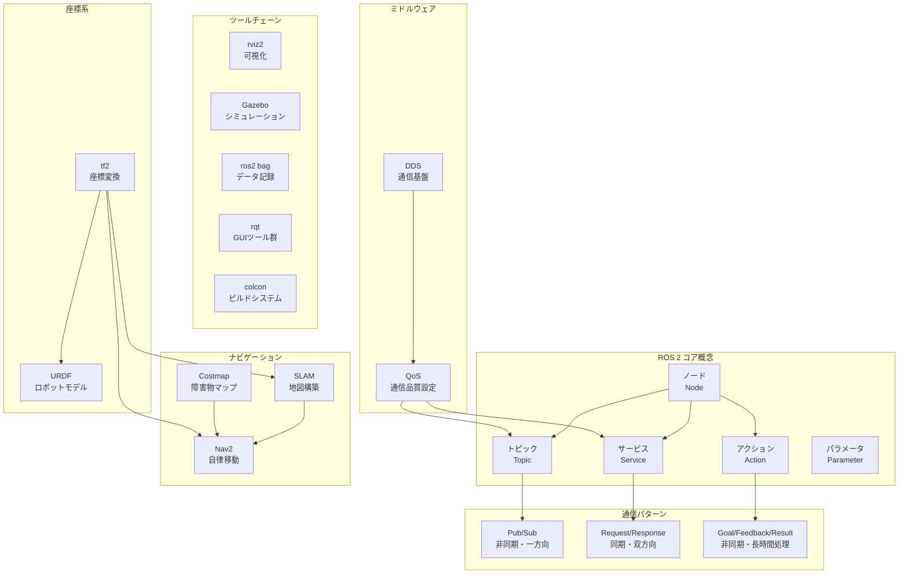

# Month 1: ROS 2 + ロボット基礎

## 概要

Physical AIエンジニアへの第一歩として、ロボットソフトウェア開発の共通言語である**ROS 2（Robot Operating System 2）**を習得する。
4週間を通じて、ROS 2の基礎概念から始まり、シミュレーション環境でのSLAM（自己位置推定と地図構築）と
自律移動までを実践的に学ぶ。

ファームウェアの経験（C/C++、回路設計、センサー）は、ロボティクスの世界で大きなアドバンテージとなる。
低レイヤーの通信プロトコル、リアルタイム処理、センサードライバの知識は、
ROS 2のノード間通信やセンサーデータ処理を理解する上で直接的に役立つ。

---

## 月末までにできるようになること

このMonthを完了すると、以下のスキルを習得できる。

1. **ROS 2 Humbleの環境を構築・運用**できる
2. **Publisher/Subscriber、Service、Action**を使ったノード間通信を実装できる
3. **tf2座標変換**を理解し、センサーフレーム間の変換を設定できる
4. **URDF**でロボットモデルを記述し、Gazeboシミュレーションで動かせる
5. **slam_toolbox**を使って環境の地図を構築できる
6. **Nav2**を使ってロボットを自律移動させられる
7. **launchファイル**で複数ノードを一括起動・管理できる
8. **ros2 bag**でデータの記録・再生ができる

**最終成果物**: Gazebo上でロボットがSLAMしながら自律走行するデモ動画

---

## なぜROS 2がPhysical AIに不可欠なのか

### ロボティクスの共通言語

ROS 2は現代のロボティクス開発における事実上の標準フレームワークである。

| 観点 | 詳細 |
|------|------|
| **業界標準** | Unitree、Boston Dynamics、NVIDIA Isaac等が全てROS 2をサポート |
| **通信基盤** | DDS（Data Distribution Service）ベースのリアルタイム通信 |
| **ツールチェーン** | 可視化（rviz2）、シミュレーション（Gazebo）、ナビゲーション（Nav2）が統合 |
| **AI連携** | PyTorch/TensorFlowとの連携、推論パイプラインの構築が容易 |
| **コミュニティ** | 世界最大のロボティクスOSSコミュニティ |

### Physical AIにおけるROS 2の役割

```
Physical AI システム全体像:

  認知 (Perception)          判断 (Decision)           行動 (Action)
  ┌─────────────┐     ┌─────────────────┐     ┌──────────────┐
  │ カメラ       │     │ AI推論エンジン    │     │ モーター制御   │
  │ LiDAR       │────>│ 経路計画         │────>│ マニピュレータ  │
  │ IMU         │     │ 行動決定         │     │ 移動制御       │
  │ 力覚センサー  │     │ 学習・適応       │     │ グリッパー     │
  └─────────────┘     └─────────────────┘     └──────────────┘
        ^                     ^                       ^
        └─────────────────────┴───────────────────────┘
                    全てROS 2が繋いでいる
```

### Unitreeロボットとの関連

Month 3以降で扱うUnitree Go2等の四足歩行ロボットは、ROS 2ベースのSDKを提供している。
Month 1でROS 2の基盤を固めておくことで、実機操作にスムーズに移行できる。

---

## ファームウェア経験が活きるポイント

ファームウェアの経験は、ロボティクス学習において極めて有利に働く。

| ファームウェアの知識 | ROS 2での対応概念 |
|---|---|
| UART/SPI/I2C通信 | ROS 2 Service（リクエスト/レスポンス） |
| 割り込みハンドラ・コールバック | ROS 2 Subscriber コールバック |
| MQTT Pub/Sub | ROS 2 Topic Pub/Sub |
| DMA転送（進捗コールバック付き） | ROS 2 Action（進捗フィードバック付き） |
| センサードライバ開発 | ROS 2 センサードライバノード |
| リアルタイムOS（FreeRTOS等） | ROS 2 リアルタイム実行（Executor） |
| make/CMakeビルド | colconビルドシステム |
| Cのヘッダファイル依存管理 | package.xmlの依存管理 |
| 組込みのタイマー割り込み | ROS 2 Timer |
| 座標変換（IMUセンサーフュージョン） | tf2座標変換フレームワーク |

**核心**: ファームウェアエンジニアは「ハードウェアに近い思考」ができる。
これはロボティクスにおいて、センサーデータの物理的な意味を理解し、
適切なフィルタリングや座標変換を施す上で非常に重要な素養である。

---

## Week-by-Week 概要

### Week 1-2: ROS 2入門（基礎固め）

```
Week 1-2 の流れ:

Day 1-2    環境構築 + ROS 2の世界観を知る
   │
Day 3-4    Publisher / Subscriber（トピック通信）
   │
Day 5-6    Service + Action（同期・非同期通信）
   │
Day 7-8    tf2 座標変換
   │
Day 9-10   パッケージ作成 + ビルドシステム
   │
Day 11-14  統合演習プロジェクト
```

**詳細**: [week1-2-ros2-intro/README.md](./week1-2-ros2-intro/README.md)

### Week 3-4: シミュレーション & SLAM（応用展開）

```
Week 3-4 の流れ:

Day 1-2    Gazebo入門（シミュレーション環境構築）
   │
Day 3-4    URDF でロボットモデルを作る
   │
Day 5-7    SLAM（自己位置推定と地図構築）
   │
Day 8-10   Nav2 ナビゲーション
   │
Day 11-14  統合プロジェクト（最終デモ）
```

**詳細**: [week3-4-slam-nav/README.md](./week3-4-slam-nav/README.md)

---

## 前提条件チェックリスト

学習を開始する前に、以下の準備が完了していることを確認する。

### 環境

- [ ] Windows 11 + WSL2 + Ubuntu 22.04 がインストール済み
- [ ] RTX 5070 のドライバがWSL2から認識されている（`nvidia-smi`で確認）
- [ ] VSCode + Remote WSL拡張がセットアップ済み
- [ ] Git がインストール・設定済み
- [ ] `docs/SETUP.md` の手順に沿って環境構築が完了している

### 知識

- [ ] Linuxの基本操作（ディレクトリ移動、パッケージ管理、シェルスクリプト基礎）
- [ ] Pythonの基礎（クラス、関数、デコレータ、仮想環境）
- [ ] C/C++ の知識（ファームウェア経験があれば問題なし）
- [ ] Gitの基本操作（commit、branch、merge）

---

## ROS 2 アーキテクチャ概念マップ



---

## 時間コミットメント

### 合計: 約60〜80時間

| 区分 | 平日（月〜金） | 週末（土・日） | 小計/週 |
|------|---------------|--------------|---------|
| Week 1 | 2〜3時間/日 x 5日 | 4〜5時間/日 x 2日 | 18〜25時間 |
| Week 2 | 2〜3時間/日 x 5日 | 4〜5時間/日 x 2日 | 18〜25時間 |
| Week 3 | 2〜3時間/日 x 5日 | 4〜5時間/日 x 2日 | 18〜25時間 |
| Week 4 | 2〜3時間/日 x 5日 | 4〜5時間/日 x 2日 | 18〜25時間 |

### 学習のリズム

- **平日朝（30分）**: 前日の復習、ドキュメント読み込み
- **平日夜（1.5〜2.5時間）**: ハンズオン実装、演習課題
- **週末（4〜5時間）**: 統合演習、プロジェクト作業、振り返り

### 効率的に進めるためのヒント

1. **毎日のゴールを明確にする**: 「今日はPublisherノードを1つ動かす」等の具体的目標
2. **手を動かすことを優先する**: ドキュメントを読むだけでなく、必ずコードを書いて動かす
3. **エラーを恐れない**: ROS 2のエラーメッセージは情報量が多く、読み解く力が重要
4. **ros2 CLI を多用する**: `ros2 topic echo`, `ros2 node info` 等でシステムの状態を常に確認
5. **ファームウェア経験を活かす**: 「これは割り込みハンドラと同じだ」等、既知の概念に紐づけて理解

---

## 月末 自己評価基準

### レベル1: 基礎習得（最低ライン）

- [ ] ROS 2のノードを起動・停止できる
- [ ] Publisher/Subscriberを自分で書ける
- [ ] turtlesimをプログラムで制御できる
- [ ] Gazeboでシミュレーションを起動できる
- [ ] URDFの基本構造を理解している

### レベル2: 実践レベル（目標ライン）

- [ ] Service/Actionを適切に使い分けられる
- [ ] tf2の座標変換を設定・デバッグできる
- [ ] launchファイルで複数ノードを管理できる
- [ ] 自作ロボットモデルでSLAMを実行できる
- [ ] Nav2で基本的な自律移動が動作する

### レベル3: 応用レベル（到達したら素晴らしい）

- [ ] C++とPython両方でノードを書ける
- [ ] カスタムメッセージ型を定義・使用できる
- [ ] Nav2のパラメータチューニングができる
- [ ] ros2 bagでデータ収集・分析のワークフローを構築できる
- [ ] Gazeboのワールドをカスタマイズできる

---

## ディレクトリ構成

```
month1-ros2-basics/
├── README.md                          # 本ファイル（Month 1 概要）
├── week1-2-ros2-intro/
│   ├── README.md                      # Week 1-2 学習ガイド
│   └── exercises/
│       ├── exercise01_hello_publisher.md
│       ├── exercise02_subscriber_logger.md
│       ├── exercise03_turtle_shapes.md
│       ├── exercise04_custom_service.md
│       ├── exercise05_tf2_frames.md
│       ├── exercise06_launch_system.md
│       └── exercise07_integration.md
└── week3-4-slam-nav/
    ├── README.md                      # Week 3-4 学習ガイド
    └── exercises/
        ├── exercise01_gazebo_basics.md
        ├── exercise02_urdf_robot.md
        ├── exercise03_slam_mapping.md
        ├── exercise04_nav2_setup.md
        ├── exercise05_autonomous_navigation.md
        ├── exercise06_sensor_integration.md
        └── exercise07_full_demo.md
```

---

## Month 2以降への接続

Month 1で習得するROS 2の基盤は、Month 2以降の全ての学習に直結する。

```
Month 1: ROS 2 + ロボット基礎
    │
    ├──> Month 2: AI + ロボット統合
    │    - コンピュータビジョン（ROS 2 + OpenCV/PyTorch）
    │    - 強化学習（Gym + ROS 2連携）
    │    - 音声/自然言語によるロボット制御
    │
    └──> Month 3: シミュレーション + ポートフォリオ
         - NVIDIA Isaac Sim
         - Unitree Go2 シミュレーション
         - 統合デモ・ポートフォリオ作成
```

Month 1の学習がしっかりしているほど、Month 2以降の進捗が加速する。
特に**tf2の理解**と**launchファイルの運用スキル**は、後半で繰り返し使う重要なスキルである。

---

## 参考リソース

| リソース | URL | 備考 |
|---------|-----|------|
| ROS 2 Humble 公式ドキュメント | https://docs.ros.org/en/humble/ | 最も信頼できる情報源 |
| ROS 2 チュートリアル | https://docs.ros.org/en/humble/Tutorials.html | 公式チュートリアル |
| Navigation2 ドキュメント | https://docs.nav2.org/ | Nav2の公式ドキュメント |
| Gazebo Sim | https://gazebosim.org/ | シミュレーション環境 |
| The Construct | https://www.theconstructsim.com/ | ROS学習プラットフォーム |
| ROS 2 Design | https://design.ros2.org/ | アーキテクチャ設計文書 |

---

> **ファームウェアエンジニアの皆さんへ**: ロボティクスの世界は、
> 組込みの世界と思っている以上に近い。センサーからデータを取得し、
> 処理し、アクチュエータを動かすという基本サイクルは同じである。
> ROS 2はそれをスケールさせるためのフレームワークに過ぎない。
> 自信を持って取り組んでほしい。
