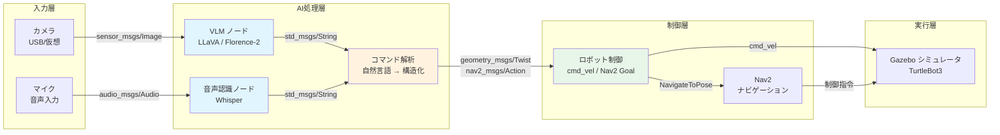

# Month 2: AI × ロボット連携

## 概要

Month 2 では、AI とロボティクスの橋渡しを行い、Vision-Language Model (VLM) を
ROS 2 パイプラインに統合する方法を学びます。Month 1 で習得した ROS 2 の基礎
（トピック通信、SLAM、Nav2）の上に、マルチモーダル AI という「頭脳」を載せることで、
ロボットが「見て、聞いて、理解して、動く」ことを実現します。

これは Physical AI の核心です。カメラ画像を理解し、音声指示を解釈し、
適切なロボット動作に変換する――この一連の流れを、あなた自身の手で構築します。

---

## なぜ Month 2 が重要なのか

Physical AI の本質は「知覚と行動の接続」にあります。

従来のロボティクスでは、センサーデータの処理とアクチュエータの制御は、
ルールベースのプログラムで結ばれていました。しかし、大規模言語モデル (LLM) と
Vision-Language Model (VLM) の登場により、この接続に「汎用的な知性」を
持ち込むことが可能になりました。

Month 2 で学ぶ内容は、まさにこの変革の中心にあります：

- **知覚 (Perception)**: カメラ画像から物体・状況を理解する
- **理解 (Understanding)**: 自然言語で状況を説明し、指示を解釈する
- **行動 (Action)**: 理解に基づいてロボットを適切に動かす

この 3 要素をつなぐパイプラインを構築する技術が、Physical AI エンジニアの
中核スキルです。

---

## あなたの経験が活きる理由

### ファームウェアエンジニアとしての経験

ファームウェアの経験は、このフェーズで大きな強みになります：

| 経験 | Month 2 での活用 |
|---|---|
| C/C++ プログラミング | ROS 2 ノードの最適化、TensorRT との連携 |
| 回路設計 | ハードウェア制約の理解、GPU メモリ管理 |
| センサー経験 | カメラ入力処理、データフロー設計 |
| ローカル LLM デプロイ | VLM のローカル実行、量子化、最適化 |

### ローカル LLM デプロイの経験

特に重要なのは、ローカル LLM のデプロイ経験です。ローカル LLM デプロイで
培った以下のスキルは、VLM の導入に直結します：

- **モデルの量子化**: LLM で経験した GGUF/GPTQ は VLM にもそのまま適用可能
- **VRAM 管理**: 8GB VRAM という制約下でのモデル運用ノウハウ
- **推論パイプライン構築**: テキスト入力→推論→出力の流れは、画像入力→推論→テキスト出力と本質的に同じ
- **ローカル実行環境構築**: WSL2 + CUDA 環境の構築経験

つまり、あなたは「テキスト→テキスト」のパイプラインを既に構築した経験があります。
Month 2 では、これを「画像＋音声→テキスト→ロボット動作」に拡張するだけです。

---

## 全体アーキテクチャ

Month 2 で構築するシステムの全体像です：



### データフローの詳細

```
カメラ画像 (640x480, 30fps)
    ↓ [sensor_msgs/Image]
VLM 推論 (LLaVA 4-bit, ~500ms/frame)
    ↓ [std_msgs/String]  例: "テーブルの上に赤いカップがあります"
コマンドパーサー
    ↓ [カスタムメッセージ]  例: {action: "navigate", target: "red_cup"}

音声入力 (16kHz, モノラル)
    ↓ [audio_msgs/Audio]
Whisper 推論 (small/medium, ~200ms)
    ↓ [std_msgs/String]  例: "赤いカップに近づいて"
コマンドパーサー
    ↓ [geometry_msgs/Twist or NavigateToPose]

ロボット制御
    ↓ [cmd_vel / Nav2 Goal]
Gazebo シミュレータ
```

---

## 週ごとの学習計画

### Week 5-6: マルチモーダル AI on エッジ（前半 2 週間）

**テーマ**: AI モデルをローカル環境で動かす

ROS 2 への統合の前に、まず AI モデル単体を RTX 5070 (8GB VRAM) 環境で
確実に動かせるようになることが目標です。

| 日 | 内容 | 目安時間 |
|---|---|---|
| Day 1-2 | VLM の世界観と主要モデルの理解 | 6-8h |
| Day 3-5 | VLM をローカルで動かす (LLaVA, 量子化) | 10-12h |
| Day 6-8 | GPU 最適化 (TensorRT, ONNX) | 10-12h |
| Day 9-10 | カメラ→VLM パイプライン構築 | 6-8h |
| Day 11-12 | 音声認識 (Whisper) のローカル実行 | 6-8h |
| Day 13-14 | 統合テストとデモ準備 | 4-6h |

**詳細**: [week5-6-multimodal-ai/README.md](./week5-6-multimodal-ai/README.md)

### Week 7-8: ROS 2 + AI 統合パイプライン（後半 2 週間）

**テーマ**: AI を ROS 2 のノードとして統合し、ロボットを動かす

Week 5-6 で構築した AI パイプラインを ROS 2 ノードとして統合し、
Gazebo シミュレータ上のロボットを音声・視覚指示で操作するデモを構築します。

| 日 | 内容 | 目安時間 |
|---|---|---|
| Day 1-2 | アーキテクチャ設計とインターフェース定義 | 6-8h |
| Day 3-4 | カメラノード & VLM ノードの実装 | 8-10h |
| Day 5-6 | 音声認識ノード & コマンドパーサーの実装 | 8-10h |
| Day 7-8 | ロボット制御ノードと Nav2 連携 | 6-8h |
| Day 9-10 | 統合テスト & レイテンシ最適化 | 6-8h |
| Day 11-14 | デモ構築・記録・ドキュメント作成 | 8-12h |

**詳細**: [week7-8-ros2-ai-pipeline/README.md](./week7-8-ros2-ai-pipeline/README.md)

---

## 前提条件

### Month 1 の完了

以下の項目が完了していることを前提とします：

- [x] ROS 2 Humble のインストールと基本操作
- [x] Publisher/Subscriber パターンの理解と実装
- [x] Service/Action パターンの理解
- [x] Launch ファイルの作成
- [x] tf2 の基本的な理解
- [x] SLAM (cartographer または slam_toolbox) の実行
- [x] Nav2 による自律ナビゲーション
- [x] Gazebo でのシミュレーション実行
- [x] TurtleBot3 の操作

### 開発環境

| 項目 | 要件 |
|---|---|
| OS | Windows 11 + WSL2 (Ubuntu 22.04) |
| GPU | NVIDIA RTX 5070 (8GB VRAM) |
| CUDA | 12.x（WSL2 対応ドライバ） |
| Python | 3.10+ (conda または venv) |
| ROS 2 | Humble Hawksbill |
| Docker | Docker Desktop for Windows (WSL2 バックエンド) |

### 追加で必要なもの

- **Web カメラ**: USB 接続（WSL2 でのパススルー用）
  - もしくは仮想カメラ（画像ファイルからのシミュレーション）
- **マイク**: USB 接続（音声認識用）
- **ディスク空き容量**: 50GB 以上（モデルファイル用）
- **インターネット接続**: モデルダウンロード用

---

## 技術スタック

Month 2 で使用する主な技術：

```
┌─────────────────────────────────────────────────────────┐
│  アプリケーション層                                       │
│  ┌───────────┐ ┌───────────┐ ┌────────────────────────┐ │
│  │ VLM 推論   │ │ Whisper   │ │ コマンドパーサー        │ │
│  │ (LLaVA)   │ │ (音声認識) │ │ (NL→ロボット指令)      │ │
│  └───────────┘ └───────────┘ └────────────────────────┘ │
├─────────────────────────────────────────────────────────┤
│  ミドルウェア層                                          │
│  ┌───────────────────────────────────────────────────┐  │
│  │ ROS 2 Humble (DDS, Topics, Services, Actions)     │  │
│  └───────────────────────────────────────────────────┘  │
├─────────────────────────────────────────────────────────┤
│  推論最適化層                                            │
│  ┌──────────┐ ┌──────────┐ ┌──────────┐ ┌──────────┐  │
│  │ PyTorch  │ │ TensorRT │ │ ONNX RT  │ │ llama.cpp│  │
│  └──────────┘ └──────────┘ └──────────┘ └──────────┘  │
├─────────────────────────────────────────────────────────┤
│  ハードウェア層                                          │
│  ┌──────────┐ ┌──────────┐ ┌──────────┐               │
│  │ RTX 5070 │ │ カメラ    │ │ マイク    │               │
│  │ (8GB)    │ │ (USB)    │ │ (USB)    │               │
│  └──────────┘ └──────────┘ └──────────┘               │
└─────────────────────────────────────────────────────────┘
```

---

## 自己評価基準

### レベル 1: 基礎理解（最低到達ライン）

- [ ] VLM の仕組み（Vision Encoder + Language Model）を説明できる
- [ ] LLaVA を量子化モデルで動かし、画像の説明を生成できる
- [ ] Whisper でローカル音声認識を実行できる
- [ ] ROS 2 ノードとして VLM を動かすことができる
- [ ] Gazebo 上のロボットに自然言語で簡単な指示を出せる

### レベル 2: 実践力（目標到達ライン）

- [ ] 複数の VLM モデルを比較し、用途に応じて選択できる
- [ ] 量子化の種類 (GPTQ, AWQ, GGUF) を理解し適切に使い分けられる
- [ ] TensorRT または ONNX Runtime で推論を最適化できる
- [ ] カメラ→VLM→コマンド→ロボット動作の全パイプラインが動作する
- [ ] レイテンシを測定し、ボトルネックを特定できる
- [ ] ノード間の QoS 設定を適切に構成できる

### レベル 3: 応用力（発展的到達ライン）

- [ ] VLA (Vision-Language-Action) モデルの概念を説明できる
- [ ] ゼロコピー通信やコンポーネントコンテナを使った最適化ができる
- [ ] 複数の AI モデルの GPU メモリを効率的に管理できる
- [ ] 独自のデモシナリオを設計・実装できる
- [ ] システム全体のアーキテクチャを図で説明できる

---

## 時間配分の目安

### 総学習時間: 約 60-80 時間

```
Week 5-6 (マルチモーダル AI):     約 30-40 時間
  ├── 座学・調査:                   8-10 時間
  ├── 環境構築・モデル実行:          10-12 時間
  ├── 最適化・パイプライン構築:      8-10 時間
  └── 統合テスト・演習:             4-8 時間

Week 7-8 (ROS 2 + AI 統合):       約 30-40 時間
  ├── アーキテクチャ設計:            4-6 時間
  ├── ノード実装:                   12-16 時間
  ├── 統合・最適化:                  8-10 時間
  └── デモ構築・記録:                6-8 時間
```

### 1 日の推奨学習パターン

```
平日 (2-3 時間/日):
  ├── 座学・ドキュメント読み:        30 分
  ├── ハンズオン (コード実装):       90-120 分
  └── 振り返り・メモ:               15-30 分

休日 (4-6 時間/日):
  ├── 座学・調査:                   60 分
  ├── ハンズオン (コード実装):       150-240 分
  ├── 演習課題:                     60 分
  └── 振り返り・メモ:               30 分
```

---

## 学習のヒント

### ファームウェアエンジニアとしての視点を活かす

1. **メモリ管理の感覚**: 組み込み開発で培ったメモリ意識は GPU VRAM 管理に直結します。
   malloc/free の感覚で、torch.cuda.empty_cache() や del model を使いましょう。

2. **リアルタイム処理の経験**: 割り込み処理やタイマー処理の経験は、
   ROS 2 のコールバック処理やレイテンシ最適化に活きます。

3. **ハードウェア制約の理解**: 「このハードウェアで何ができるか」を見極める力は、
   8GB VRAM で動くモデルの選定に直結します。

4. **デバッグの体系的アプローチ**: 信号をオシロスコープで確認するように、
   ros2 topic echo や rqt でデータフローを可視化しましょう。

### 学習の進め方

- **Week 5-6 を確実に終えてから Week 7-8 に進む**: AI モデルが単体で動かないのに
  ROS 2 に統合しようとすると、デバッグが困難になります。
- **小さく動かして、少しずつ拡張する**: まず 1 枚の画像で VLM を動かし、
  次にカメラ入力、次に ROS 2 ノード、という順序で進めましょう。
- **VRAM エラーを恐れない**: OOM (Out of Memory) エラーは日常茶飯事です。
  量子化やバッチサイズ調整で対処する方法を学びましょう。

---

## ディレクトリ構成

```
month2-ai-robot-integration/
├── README.md                          # このファイル
├── week5-6-multimodal-ai/
│   ├── README.md                      # Week 5-6 学習ガイド
│   ├── exercises/
│   │   ├── exercise01_vlm_inference.md
│   │   ├── exercise02_quantization.md
│   │   ├── exercise03_tensorrt_optimization.md
│   │   ├── exercise04_camera_pipeline.md
│   │   ├── exercise05_whisper_speech.md
│   │   └── exercise06_multimodal_demo.md
│   └── src/                           # サンプルコード・ワークスペース
└── week7-8-ros2-ai-pipeline/
    ├── README.md                      # Week 7-8 学習ガイド
    ├── exercises/
    │   ├── exercise01_camera_node.md
    │   ├── exercise02_vlm_ros2_node.md
    │   ├── exercise03_speech_node.md
    │   ├── exercise04_command_parser.md
    │   ├── exercise05_integration.md
    │   ├── exercise06_latency_optimization.md
    │   └── exercise07_demo_scenario.md
    └── src/                           # ROS 2 パッケージワークスペース
```

---

## Month 3 への接続

Month 2 で構築した「AI × ロボット連携」パイプラインは、Month 3 の以下の内容に
直接つながります：

- **シミュレーション環境の高度化**: Gazebo/Isaac Sim でのより複雑なシナリオ
- **ポートフォリオ構築**: Month 2 のデモを磨き上げ、公開可能な形にまとめる
- **実機への展開準備**: シミュレーションから実機へのギャップを埋める

Month 2 を着実にこなすことで、Physical AI エンジニアとしての実践力の
基盤が確立されます。

---

## トラブルシューティング（共通）

| 問題 | 原因 | 対処法 |
|---|---|---|
| CUDA が認識されない | WSL2 ドライバの問題 | Windows 側の NVIDIA ドライバを最新に更新 |
| VRAM 不足 (OOM) | モデルサイズが大きすぎる | 量子化 (4-bit) を使用、バッチサイズ削減 |
| モデルダウンロードが遅い | HuggingFace のサーバー | HF_HUB_ENABLE_HF_TRANSFER=1 を設定 |
| WSL2 で GUI が表示されない | X11/Wayland の設定 | WSLg を確認、または VcXsrv を使用 |
| ROS 2 と Python 仮想環境の競合 | パス設定の問題 | conda/venv 内から ROS 2 を source |

---

> **次のステップ**: [Week 5-6: マルチモーダル AI on エッジ](./week5-6-multimodal-ai/README.md) に進みましょう。
