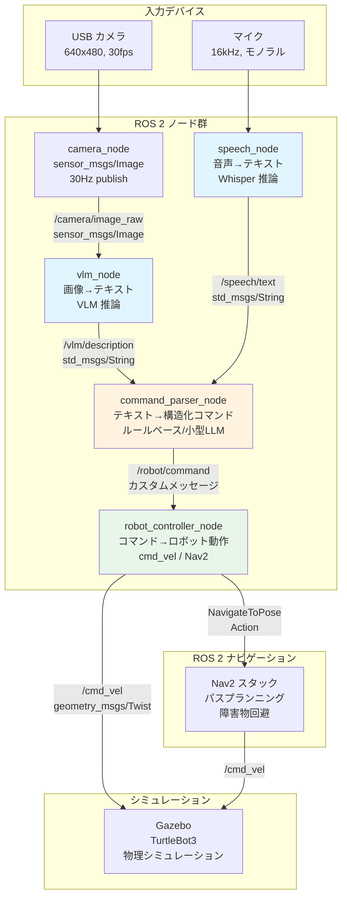

# Week 7-8: ROS 2 + AI 統合パイプライン

## 概要

Week 7-8 では、Week 5-6 で構築したマルチモーダル AI パイプライン（VLM、Whisper）を
ROS 2 のノードとして統合し、Gazebo シミュレータ上のロボットを
自然言語で操作するデモを構築します。

これは Month 2 の集大成であり、Physical AI の核心的なアーキテクチャである
「知覚→理解→行動」のループを、実際に動くシステムとして完成させます。

ファームウェアエンジニアとしてのあなたにとって、これは「センサー入力→処理→アクチュエータ出力」
というおなじみのパターンを、AI と ROS 2 というレイヤーで再構築する作業です。
割り込み処理やリアルタイム制約の経験が、ノード間レイテンシの最適化に直結します。

---

## 学習目標

1. **ROS 2 ノードとしての AI モデル統合**
   - VLM、Whisper を ROS 2 ノードとしてラップできる
   - ノードのライフサイクル管理と GPU リソースの適切な制御

2. **ノード間通信のレイテンシ最適化**
   - QoS 設定の最適化
   - ゼロコピー通信、コンポーネントコンテナの活用
   - ボトルネックの計測と対処

3. **「自然言語で指示 → ロボットが動く」デモの構築**
   - 音声指示をロボット動作に変換するパイプライン
   - Nav2 との連携による自律ナビゲーション

4. **到達目標**: ROS 2 上で「目の前の物体を認識して説明し、指示に従って動く」統合デモが動作する

---

## 前提知識の確認

### ROS 2 (Month 1 の復習)

- [ ] Publisher / Subscriber パターンの実装
- [ ] Service / Action の実装と使い分け
- [ ] Launch ファイルの作成
- [ ] tf2 の基本（座標変換）
- [ ] QoS (Quality of Service) の基本概念
- [ ] Nav2 による自律ナビゲーション
- [ ] Gazebo でのシミュレーション実行

### マルチモーダル AI (Week 5-6)

- [ ] VLM (LLaVA) の推論パイプラインが動作する
- [ ] 4-bit 量子化でモデルをロードできる
- [ ] カメラ画像→VLM→テキストのパイプラインが動作する
- [ ] Whisper でローカル音声認識ができる
- [ ] GPU メモリ管理の基本を理解している

### ROS 2 メッセージ型

- [ ] `sensor_msgs/msg/Image` - カメラ画像
- [ ] `std_msgs/msg/String` - テキストデータ
- [ ] `geometry_msgs/msg/Twist` - 速度指令
- [ ] `nav2_msgs/action/NavigateToPose` - ナビゲーション目標

---

## 推奨学習順序

### Day 1-2: アーキテクチャ設計

#### システムアーキテクチャ



#### ノード一覧と責務

| ノード | 入力 | 出力 | 処理内容 |
|---|---|---|---|
| camera_node | USB カメラ / 仮想 | sensor_msgs/Image | 画像取得・配信 |
| vlm_node | sensor_msgs/Image | std_msgs/String | VLM による画像認識 |
| speech_node | マイク音声 | std_msgs/String | Whisper 音声認識 |
| command_parser_node | std_msgs/String (x2) | RobotCommand (カスタム) | 自然言語→コマンド変換 |
| robot_controller_node | RobotCommand | Twist / NavigateToPose | コマンド→ロボット動作 |

#### カスタムメッセージの定義

```bash
# パッケージの作成
cd ~/ros2_ws/src
ros2 pkg create ai_robot_msgs --build-type ament_cmake --dependencies std_msgs geometry_msgs
```

```
# msg/RobotCommand.msg
# ロボットへの構造化コマンド

string command_type    # "move", "turn", "stop", "navigate", "describe"
string target          # 対象物 ("red_cup", "door", etc.)
float64 value          # 数値パラメータ (距離、角度など)
string raw_text        # 元の自然言語テキスト
builtin_interfaces/Time timestamp
```

```
# msg/VLMResult.msg
# VLM の認識結果

string description           # 画像の説明テキスト
string[] detected_objects    # 検出された物体名のリスト
float64 inference_time       # 推論時間 (秒)
sensor_msgs/Image source_image  # 元画像 (オプション)
builtin_interfaces/Time timestamp
```

```
# srv/AskVLM.srv
# VLM への質問サービス

sensor_msgs/Image image    # 質問対象の画像
string question            # 質問テキスト
---
string answer              # 回答テキスト
float64 inference_time     # 推論時間
```

#### QoS 設定の方針

```python
"""
各トピックの QoS 設定方針
ファームウェア開発の通信プロトコル設計と同様の考え方
"""
from rclpy.qos import QoSProfile, ReliabilityPolicy, HistoryPolicy, DurabilityPolicy

# カメラ画像: 最新フレームのみ重要、遅延よりリアルタイム性を優先
camera_qos = QoSProfile(
    reliability=ReliabilityPolicy.BEST_EFFORT,  # ドロップ許容
    history=HistoryPolicy.KEEP_LAST,
    depth=1,                                     # 最新 1 フレームのみ
)

# VLM 結果: 確実に配信、ただし遅延許容
vlm_result_qos = QoSProfile(
    reliability=ReliabilityPolicy.RELIABLE,      # 確実配信
    history=HistoryPolicy.KEEP_LAST,
    depth=5,
)

# ロボットコマンド: 確実に配信
command_qos = QoSProfile(
    reliability=ReliabilityPolicy.RELIABLE,
    history=HistoryPolicy.KEEP_LAST,
    depth=10,
)

# cmd_vel: 最新値のみ重要
cmd_vel_qos = QoSProfile(
    reliability=ReliabilityPolicy.BEST_EFFORT,
    history=HistoryPolicy.KEEP_LAST,
    depth=1,
)
```

---

### Day 3-4: カメラノード & VLM ノード

#### camera_node の実装

```python
"""
camera_node.py
USB カメラから画像を取得して ROS 2 トピックに配信するノード
"""
import rclpy
from rclpy.node import Node
from sensor_msgs.msg import Image
from cv_bridge import CvBridge
from rclpy.qos import QoSProfile, ReliabilityPolicy, HistoryPolicy
import cv2


class CameraNode(Node):
    """カメラ画像を配信する ROS 2 ノード"""

    def __init__(self):
        super().__init__('camera_node')

        # パラメータの宣言
        self.declare_parameter('device_id', 0)
        self.declare_parameter('frame_width', 640)
        self.declare_parameter('frame_height', 480)
        self.declare_parameter('fps', 30.0)
        self.declare_parameter('use_virtual_camera', False)
        self.declare_parameter('virtual_image_path', '')

        # パラメータの取得
        self.device_id = self.get_parameter('device_id').value
        self.frame_width = self.get_parameter('frame_width').value
        self.frame_height = self.get_parameter('frame_height').value
        self.fps = self.get_parameter('fps').value
        self.use_virtual = self.get_parameter('use_virtual_camera').value
        self.virtual_path = self.get_parameter('virtual_image_path').value

        # QoS 設定
        camera_qos = QoSProfile(
            reliability=ReliabilityPolicy.BEST_EFFORT,
            history=HistoryPolicy.KEEP_LAST,
            depth=1,
        )

        # Publisher
        self.publisher = self.create_publisher(
            Image, '/camera/image_raw', camera_qos
        )

        # cv_bridge
        self.bridge = CvBridge()

        # カメラの初期化
        if not self.use_virtual:
            self.cap = cv2.VideoCapture(self.device_id)
            self.cap.set(cv2.CAP_PROP_FRAME_WIDTH, self.frame_width)
            self.cap.set(cv2.CAP_PROP_FRAME_HEIGHT, self.frame_height)

            if not self.cap.isOpened():
                self.get_logger().warn(
                    'カメラを開けません。仮想カメラモードに切り替えます。'
                )
                self.use_virtual = True
        else:
            self.get_logger().info('仮想カメラモードで起動')

        # タイマーコールバック
        timer_period = 1.0 / self.fps
        self.timer = self.create_timer(timer_period, self.timer_callback)

        self.get_logger().info(
            f'CameraNode 起動完了 ({self.frame_width}x{self.frame_height}, {self.fps}fps)'
        )

    def timer_callback(self):
        """タイマーコールバック: 画像をキャプチャして配信"""
        if self.use_virtual:
            frame = cv2.imread(self.virtual_path)
            if frame is None:
                self.get_logger().error(f'画像が読めません: {self.virtual_path}')
                return
        else:
            ret, frame = self.cap.read()
            if not ret:
                self.get_logger().warn('フレームの取得に失敗')
                return

        # OpenCV (BGR) → ROS 2 Image メッセージに変換
        msg = self.bridge.cv2_to_imgmsg(frame, encoding='bgr8')
        msg.header.stamp = self.get_clock().now().to_msg()
        msg.header.frame_id = 'camera_frame'

        self.publisher.publish(msg)

    def destroy_node(self):
        """ノード破棄時のクリーンアップ"""
        if hasattr(self, 'cap') and self.cap is not None:
            self.cap.release()
        super().destroy_node()


def main(args=None):
    rclpy.init(args=args)
    node = CameraNode()
    try:
        rclpy.spin(node)
    except KeyboardInterrupt:
        pass
    finally:
        node.destroy_node()
        rclpy.shutdown()


if __name__ == '__main__':
    main()
```

#### vlm_node の実装

```python
"""
vlm_node.py
カメラ画像を受信し、VLM で認識してテキストを配信するノード

重要な設計判断:
- 推論は非同期で実行（コールバックをブロックしない）
- GPU メモリはノード起動時に確保し、終了時に解放
- 全フレームではなく、一定間隔で推論を実行
"""
import rclpy
from rclpy.node import Node
from rclpy.callback_groups import ReentrantCallbackGroup
from rclpy.executors import MultiThreadedExecutor
from sensor_msgs.msg import Image
from std_msgs.msg import String
from cv_bridge import CvBridge
from rclpy.qos import QoSProfile, ReliabilityPolicy, HistoryPolicy

import torch
from transformers import LlavaNextProcessor, LlavaNextForConditionalGeneration, BitsAndBytesConfig
from PIL import Image as PILImage
import numpy as np
import time
from threading import Lock


class VLMNode(Node):
    """VLM 推論を行う ROS 2 ノード"""

    def __init__(self):
        super().__init__('vlm_node')

        # パラメータ
        self.declare_parameter('model_id', 'llava-hf/llava-v1.6-mistral-7b-hf')
        self.declare_parameter('max_new_tokens', 128)
        self.declare_parameter('inference_interval', 2.0)  # 秒
        self.declare_parameter('prompt', 'この画像に何が写っていますか？日本語で簡潔に説明してください。')

        self.model_id = self.get_parameter('model_id').value
        self.max_tokens = self.get_parameter('max_new_tokens').value
        self.inference_interval = self.get_parameter('inference_interval').value
        self.prompt_text = self.get_parameter('prompt').value

        # コールバックグループ（非同期実行用）
        self.cb_group = ReentrantCallbackGroup()

        # QoS 設定
        camera_qos = QoSProfile(
            reliability=ReliabilityPolicy.BEST_EFFORT,
            history=HistoryPolicy.KEEP_LAST,
            depth=1,
        )
        result_qos = QoSProfile(
            reliability=ReliabilityPolicy.RELIABLE,
            history=HistoryPolicy.KEEP_LAST,
            depth=5,
        )

        # Subscriber & Publisher
        self.subscription = self.create_subscription(
            Image,
            '/camera/image_raw',
            self.image_callback,
            camera_qos,
            callback_group=self.cb_group,
        )
        self.publisher = self.create_publisher(
            String, '/vlm/description', result_qos
        )

        # cv_bridge
        self.bridge = CvBridge()

        # 推論制御
        self.inference_lock = Lock()
        self.is_inferring = False
        self.last_inference_time = 0.0

        # VLM モデルのロード
        self.get_logger().info(f'VLM モデルをロード中: {self.model_id}')
        self._load_model()
        self.get_logger().info(
            f'VLM モデルロード完了 '
            f'(VRAM: {torch.cuda.memory_allocated() / 1024**3:.2f} GB)'
        )

    def _load_model(self):
        """VLM モデルを 4-bit 量子化でロード"""
        quantization_config = BitsAndBytesConfig(
            load_in_4bit=True,
            bnb_4bit_quant_type="nf4",
            bnb_4bit_compute_dtype=torch.float16,
            bnb_4bit_use_double_quant=True,
        )

        self.processor = LlavaNextProcessor.from_pretrained(self.model_id)
        self.model = LlavaNextForConditionalGeneration.from_pretrained(
            self.model_id,
            quantization_config=quantization_config,
            device_map="auto",
            torch_dtype=torch.float16,
        )

    def image_callback(self, msg: Image):
        """
        画像受信コールバック

        重要: このコールバック内で直接推論を行うとブロッキングが発生する。
        推論間隔と排他制御で対処する。
        ファームウェア開発での割り込みハンドラと同様に、
        重い処理は避け、フラグ設定程度に留めるのが理想。
        """
        current_time = time.time()

        # 推論間隔のチェック
        if current_time - self.last_inference_time < self.inference_interval:
            return

        # 排他制御: 推論中なら新しいリクエストを無視
        if not self.inference_lock.acquire(blocking=False):
            return

        try:
            self.last_inference_time = current_time

            # ROS 2 Image → OpenCV → PIL
            cv_image = self.bridge.imgmsg_to_cv2(msg, desired_encoding='rgb8')
            pil_image = PILImage.fromarray(cv_image)

            # VLM 推論
            start_time = time.perf_counter()
            result_text = self._run_inference(pil_image)
            elapsed = time.perf_counter() - start_time

            # 結果の配信
            result_msg = String()
            result_msg.data = result_text
            self.publisher.publish(result_msg)

            self.get_logger().info(
                f'VLM 推論完了 ({elapsed:.2f}s): {result_text[:80]}...'
            )

        except Exception as e:
            self.get_logger().error(f'VLM 推論エラー: {e}')
        finally:
            self.inference_lock.release()

    def _run_inference(self, image: PILImage) -> str:
        """VLM 推論を実行"""
        prompt = f"[INST] <image>\n{self.prompt_text} [/INST]"

        inputs = self.processor(prompt, image, return_tensors="pt").to(
            self.model.device
        )

        with torch.no_grad():
            output = self.model.generate(
                **inputs,
                max_new_tokens=self.max_tokens,
                do_sample=True,
                temperature=0.7,
            )

        result = self.processor.decode(output[0], skip_special_tokens=True)

        # プロンプト部分を除去して回答のみ返す
        if "[/INST]" in result:
            result = result.split("[/INST]")[-1].strip()

        return result

    def destroy_node(self):
        """ノード破棄時に GPU メモリを解放"""
        if hasattr(self, 'model'):
            del self.model
            del self.processor
            torch.cuda.empty_cache()
            self.get_logger().info('VLM モデルを解放しました')
        super().destroy_node()


def main(args=None):
    rclpy.init(args=args)
    node = VLMNode()
    executor = MultiThreadedExecutor(num_threads=2)
    executor.add_node(node)
    try:
        executor.spin()
    except KeyboardInterrupt:
        pass
    finally:
        node.destroy_node()
        rclpy.shutdown()


if __name__ == '__main__':
    main()
```

---

### Day 5-6: 音声認識ノード & コマンドパーサー

#### speech_recognition_node の実装

```python
"""
speech_recognition_node.py
マイク音声を Whisper で認識し、テキストを配信するノード

WSL2 でのオーディオ制約:
- PulseAudio / PipeWire の設定が必要な場合あり
- 代替: 音声ファイルを入力として使用
- 代替: Windows 側で録音し、共有ディレクトリ経由で読み込み
"""
import rclpy
from rclpy.node import Node
from std_msgs.msg import String
from rclpy.qos import QoSProfile, ReliabilityPolicy, HistoryPolicy

from faster_whisper import WhisperModel
import numpy as np
import time
from threading import Thread, Event

# WSL2 で pyaudio が使えない場合のフォールバック
try:
    import pyaudio
    AUDIO_AVAILABLE = True
except ImportError:
    AUDIO_AVAILABLE = False


class SpeechRecognitionNode(Node):
    """Whisper 音声認識ノード"""

    def __init__(self):
        super().__init__('speech_recognition_node')

        # パラメータ
        self.declare_parameter('whisper_model', 'small')
        self.declare_parameter('language', 'ja')
        self.declare_parameter('record_duration', 5.0)
        self.declare_parameter('sample_rate', 16000)
        self.declare_parameter('use_file_input', False)
        self.declare_parameter('audio_file_path', '')

        self.whisper_model_size = self.get_parameter('whisper_model').value
        self.language = self.get_parameter('language').value
        self.record_duration = self.get_parameter('record_duration').value
        self.sample_rate = self.get_parameter('sample_rate').value
        self.use_file_input = self.get_parameter('use_file_input').value
        self.audio_file_path = self.get_parameter('audio_file_path').value

        # Publisher
        result_qos = QoSProfile(
            reliability=ReliabilityPolicy.RELIABLE,
            history=HistoryPolicy.KEEP_LAST,
            depth=10,
        )
        self.publisher = self.create_publisher(
            String, '/speech/text', result_qos
        )

        # Whisper モデルのロード
        self.get_logger().info(
            f'Whisper モデルをロード中: {self.whisper_model_size}'
        )
        self.whisper = WhisperModel(
            self.whisper_model_size,
            device="cuda",
            compute_type="float16",
        )
        self.get_logger().info('Whisper モデルロード完了')

        # 音声認識ループの開始
        self.stop_event = Event()
        self.recognition_thread = Thread(
            target=self._recognition_loop, daemon=True
        )
        self.recognition_thread.start()

        self.get_logger().info('SpeechRecognitionNode 起動完了')

    def _recognition_loop(self):
        """音声認識の連続ループ"""
        while not self.stop_event.is_set():
            try:
                if self.use_file_input:
                    # ファイル入力モード（デバッグ/WSL2 フォールバック用）
                    text = self._transcribe_file(self.audio_file_path)
                    time.sleep(self.record_duration)  # 擬似的な待機
                elif AUDIO_AVAILABLE:
                    # マイク入力モード
                    audio_data = self._record_audio()
                    text = self._transcribe_audio(audio_data)
                else:
                    self.get_logger().warn(
                        'pyaudio が利用できません。ファイルモードを使用してください。'
                    )
                    time.sleep(5.0)
                    continue

                if text and text.strip():
                    msg = String()
                    msg.data = text.strip()
                    self.publisher.publish(msg)
                    self.get_logger().info(f'認識結果: {text.strip()}')

            except Exception as e:
                self.get_logger().error(f'音声認識エラー: {e}')
                time.sleep(1.0)

    def _record_audio(self):
        """マイクから音声を録音"""
        p = pyaudio.PyAudio()
        stream = p.open(
            format=pyaudio.paFloat32,
            channels=1,
            rate=self.sample_rate,
            input=True,
            frames_per_buffer=1024,
        )

        self.get_logger().info(
            f'録音中... ({self.record_duration}秒)'
        )
        frames = []
        n_frames = int(self.sample_rate / 1024 * self.record_duration)
        for _ in range(n_frames):
            data = stream.read(1024, exception_on_overflow=False)
            frames.append(np.frombuffer(data, dtype=np.float32))

        stream.stop_stream()
        stream.close()
        p.terminate()

        return np.concatenate(frames)

    def _transcribe_audio(self, audio_data):
        """音声データをテキストに変換"""
        import wave
        import tempfile

        # 一時ファイルに保存
        temp_path = tempfile.mktemp(suffix='.wav')
        with wave.open(temp_path, 'wb') as wf:
            wf.setnchannels(1)
            wf.setsampwidth(4)
            wf.setframerate(self.sample_rate)
            wf.writeframes(audio_data.tobytes())

        return self._transcribe_file(temp_path)

    def _transcribe_file(self, file_path):
        """音声ファイルをテキストに変換"""
        segments, info = self.whisper.transcribe(
            file_path,
            language=self.language,
            beam_size=5,
            vad_filter=True,
        )
        text = " ".join([s.text for s in segments])
        return text.strip()

    def destroy_node(self):
        """クリーンアップ"""
        self.stop_event.set()
        if hasattr(self, 'recognition_thread'):
            self.recognition_thread.join(timeout=5.0)
        super().destroy_node()


def main(args=None):
    rclpy.init(args=args)
    node = SpeechRecognitionNode()
    try:
        rclpy.spin(node)
    except KeyboardInterrupt:
        pass
    finally:
        node.destroy_node()
        rclpy.shutdown()


if __name__ == '__main__':
    main()
```

#### command_parser_node の実装

```python
"""
command_parser_node.py
自然言語テキストをロボットコマンドに変換するノード

設計方針:
- まずルールベースで実装（信頼性重視）
- 将来的に小型 LLM によるパース機能に置き換え可能
- ファームウェア開発でのコマンドパーサーと同様のアプローチ
"""
import rclpy
from rclpy.node import Node
from std_msgs.msg import String
from rclpy.qos import QoSProfile, ReliabilityPolicy, HistoryPolicy

import re
from dataclasses import dataclass
from typing import Optional


@dataclass
class ParsedCommand:
    """パース済みコマンド"""
    command_type: str    # "move", "turn", "stop", "navigate", "describe"
    target: str = ""     # 対象物
    value: float = 0.0   # 数値パラメータ
    raw_text: str = ""   # 元のテキスト


class CommandParserNode(Node):
    """自然言語→ロボットコマンド変換ノード"""

    def __init__(self):
        super().__init__('command_parser_node')

        # QoS
        text_qos = QoSProfile(
            reliability=ReliabilityPolicy.RELIABLE,
            history=HistoryPolicy.KEEP_LAST,
            depth=10,
        )

        # VLM の出力を購読
        self.vlm_sub = self.create_subscription(
            String, '/vlm/description', self.vlm_callback, text_qos
        )

        # 音声認識の出力を購読
        self.speech_sub = self.create_subscription(
            String, '/speech/text', self.speech_callback, text_qos
        )

        # パース結果を配信（RobotCommand カスタムメッセージの代わりに String を使用）
        self.command_pub = self.create_publisher(
            String, '/robot/command', text_qos
        )

        # VLM の最新認識結果を保持
        self.latest_vlm_description = ""

        # コマンドパターンの定義（日本語）
        self.command_patterns = self._define_patterns()

        self.get_logger().info('CommandParserNode 起動完了')

    def _define_patterns(self):
        """
        コマンドパターンの定義
        ファームウェアのコマンドテーブルと同様のアプローチ
        """
        return [
            # 前進
            {
                'patterns': [
                    r'前に(進め|進んで|行って|動いて)',
                    r'前進',
                    r'まっすぐ(進め|進んで|行って)',
                    r'forward',
                ],
                'command': ParsedCommand('move', value=0.5),
            },
            # 後退
            {
                'patterns': [
                    r'後ろに(下がれ|下がって|戻って)',
                    r'後退',
                    r'バック',
                    r'backward',
                ],
                'command': ParsedCommand('move', value=-0.5),
            },
            # 左旋回
            {
                'patterns': [
                    r'左に(曲がれ|曲がって|回って|向いて)',
                    r'左折',
                    r'左回転',
                    r'turn\s*left',
                ],
                'command': ParsedCommand('turn', value=0.5),
            },
            # 右旋回
            {
                'patterns': [
                    r'右に(曲がれ|曲がって|回って|向いて)',
                    r'右折',
                    r'右回転',
                    r'turn\s*right',
                ],
                'command': ParsedCommand('turn', value=-0.5),
            },
            # 停止
            {
                'patterns': [
                    r'止まれ',
                    r'止まって',
                    r'停止',
                    r'ストップ',
                    r'stop',
                ],
                'command': ParsedCommand('stop'),
            },
            # ナビゲーション（物体に近づく）
            {
                'patterns': [
                    r'(.+)に近づ(け|いて)',
                    r'(.+)の方に(行け|行って|進んで)',
                    r'(.+)まで(行け|行って|移動して)',
                ],
                'command': ParsedCommand('navigate'),
                'extract_target': True,
            },
            # 描写要求
            {
                'patterns': [
                    r'何が(ある|見える|写って)',
                    r'目の前に何が',
                    r'周りを(見て|教えて|説明して)',
                    r'describe',
                    r'what do you see',
                ],
                'command': ParsedCommand('describe'),
            },
        ]

    def vlm_callback(self, msg: String):
        """VLM の認識結果を保持"""
        self.latest_vlm_description = msg.data
        self.get_logger().debug(f'VLM 結果更新: {msg.data[:50]}...')

    def speech_callback(self, msg: String):
        """音声認識結果を受信してコマンドに変換"""
        text = msg.data.strip()
        self.get_logger().info(f'音声入力: {text}')

        # テキストをパース
        command = self._parse_command(text)

        if command:
            # コマンドを配信
            cmd_msg = String()
            cmd_msg.data = (
                f'{command.command_type}|'
                f'{command.target}|'
                f'{command.value}|'
                f'{command.raw_text}'
            )
            self.command_pub.publish(cmd_msg)
            self.get_logger().info(
                f'コマンド発行: {command.command_type} '
                f'(target={command.target}, value={command.value})'
            )

            # describe コマンドの場合、VLM の最新結果を返す
            if command.command_type == 'describe':
                response_msg = String()
                response_msg.data = (
                    f'describe_response|{self.latest_vlm_description}'
                )
                self.command_pub.publish(response_msg)
        else:
            self.get_logger().warn(f'コマンドを認識できません: {text}')

    def _parse_command(self, text: str) -> Optional[ParsedCommand]:
        """
        自然言語テキストをコマンドにパース

        ルールベースの実装。将来的に小型 LLM に置き換え可能。
        """
        for pattern_def in self.command_patterns:
            for pattern in pattern_def['patterns']:
                match = re.search(pattern, text, re.IGNORECASE)
                if match:
                    cmd = ParsedCommand(
                        command_type=pattern_def['command'].command_type,
                        value=pattern_def['command'].value,
                        raw_text=text,
                    )

                    # ターゲット抽出
                    if pattern_def.get('extract_target') and match.groups():
                        cmd.target = match.group(1)

                    return cmd

        return None


def main(args=None):
    rclpy.init(args=args)
    node = CommandParserNode()
    try:
        rclpy.spin(node)
    except KeyboardInterrupt:
        pass
    finally:
        node.destroy_node()
        rclpy.shutdown()


if __name__ == '__main__':
    main()
```

---

### Day 7-8: ロボット制御ノード

#### robot_controller_node の実装

```python
"""
robot_controller_node.py
パースされたコマンドをロボットの動作に変換するノード

機能:
- 直接的な速度制御 (cmd_vel)
- Nav2 を使ったナビゲーション目標の設定
- 安全チェック (速度制限、障害物回避)
"""
import rclpy
from rclpy.node import Node
from rclpy.action import ActionClient
from geometry_msgs.msg import Twist, PoseStamped
from std_msgs.msg import String
from nav2_msgs.action import NavigateToPose
from rclpy.qos import QoSProfile, ReliabilityPolicy, HistoryPolicy

import time
from dataclasses import dataclass


class RobotControllerNode(Node):
    """ロボット制御ノード"""

    def __init__(self):
        super().__init__('robot_controller_node')

        # パラメータ
        self.declare_parameter('max_linear_vel', 0.3)   # m/s
        self.declare_parameter('max_angular_vel', 1.0)   # rad/s
        self.declare_parameter('command_duration', 2.0)   # 秒

        self.max_linear = self.get_parameter('max_linear_vel').value
        self.max_angular = self.get_parameter('max_angular_vel').value
        self.cmd_duration = self.get_parameter('command_duration').value

        # QoS
        cmd_qos = QoSProfile(
            reliability=ReliabilityPolicy.RELIABLE,
            history=HistoryPolicy.KEEP_LAST,
            depth=10,
        )

        # Subscriber: コマンド受信
        self.command_sub = self.create_subscription(
            String, '/robot/command', self.command_callback, cmd_qos
        )

        # Publisher: 速度指令
        self.vel_pub = self.create_publisher(
            Twist, '/cmd_vel', 10
        )

        # Action Client: Nav2 ナビゲーション
        self.nav_client = ActionClient(
            self, NavigateToPose, 'navigate_to_pose'
        )

        # 状態管理
        self.is_moving = False
        self.current_command = None

        self.get_logger().info('RobotControllerNode 起動完了')

    def command_callback(self, msg: String):
        """コマンドを受信してロボットを制御"""
        parts = msg.data.split('|')
        if len(parts) < 3:
            return

        cmd_type = parts[0]
        target = parts[1]
        try:
            value = float(parts[2])
        except ValueError:
            value = 0.0

        self.get_logger().info(
            f'コマンド受信: type={cmd_type}, target={target}, value={value}'
        )

        if cmd_type == 'move':
            self._execute_move(value)
        elif cmd_type == 'turn':
            self._execute_turn(value)
        elif cmd_type == 'stop':
            self._execute_stop()
        elif cmd_type == 'navigate':
            self._execute_navigate(target)
        elif cmd_type == 'describe':
            # 描写コマンドはロボット動作不要
            pass

    def _execute_move(self, velocity: float):
        """直進コマンドの実行"""
        twist = Twist()
        # 速度制限（安全チェック）
        twist.linear.x = max(
            -self.max_linear,
            min(self.max_linear, velocity)
        )

        self.get_logger().info(
            f'移動: linear.x = {twist.linear.x:.2f} m/s '
            f'({self.cmd_duration}秒間)'
        )

        # 一定時間移動して停止
        self._publish_velocity_for_duration(twist, self.cmd_duration)

    def _execute_turn(self, angular_velocity: float):
        """旋回コマンドの実行"""
        twist = Twist()
        twist.angular.z = max(
            -self.max_angular,
            min(self.max_angular, angular_velocity)
        )

        self.get_logger().info(
            f'旋回: angular.z = {twist.angular.z:.2f} rad/s '
            f'({self.cmd_duration}秒間)'
        )

        self._publish_velocity_for_duration(twist, self.cmd_duration)

    def _execute_stop(self):
        """停止コマンドの実行"""
        twist = Twist()  # 全てゼロ
        self.vel_pub.publish(twist)
        self.get_logger().info('停止')

    def _execute_navigate(self, target: str):
        """
        ナビゲーションコマンドの実行

        注意: 現在の実装では固定座標への移動。
        実際には VLM の認識結果と深度情報から
        ターゲットの 3D 位置を推定する必要がある。
        """
        self.get_logger().info(f'ナビゲーション: target={target}')

        # Nav2 Action Server の待機
        if not self.nav_client.wait_for_server(timeout_sec=5.0):
            self.get_logger().error('Nav2 Action Server が利用できません')
            return

        # ナビゲーション目標の作成
        goal = NavigateToPose.Goal()
        goal.pose = PoseStamped()
        goal.pose.header.frame_id = 'map'
        goal.pose.header.stamp = self.get_clock().now().to_msg()

        # 仮の目標位置（実際にはターゲット検出結果から算出）
        goal.pose.pose.position.x = 1.0
        goal.pose.pose.position.y = 0.0
        goal.pose.pose.orientation.w = 1.0

        self.get_logger().info(
            f'Nav2 目標送信: ({goal.pose.pose.position.x}, '
            f'{goal.pose.pose.position.y})'
        )

        # ナビゲーションの実行
        future = self.nav_client.send_goal_async(
            goal, feedback_callback=self._nav_feedback_callback
        )
        future.add_done_callback(self._nav_goal_response_callback)

    def _publish_velocity_for_duration(self, twist: Twist, duration: float):
        """一定時間速度を配信して停止"""
        rate = self.create_rate(10)  # 10Hz
        end_time = time.time() + duration

        while time.time() < end_time:
            self.vel_pub.publish(twist)
            rate.sleep()

        # 停止
        self.vel_pub.publish(Twist())

    def _nav_feedback_callback(self, feedback_msg):
        """ナビゲーションフィードバック"""
        feedback = feedback_msg.feedback
        self.get_logger().debug(
            f'ナビゲーション中... 残り距離: '
            f'{feedback.distance_remaining:.2f}m'
        )

    def _nav_goal_response_callback(self, future):
        """ナビゲーション目標の受理確認"""
        goal_handle = future.result()
        if not goal_handle.accepted:
            self.get_logger().warn('ナビゲーション目標が拒否されました')
            return

        self.get_logger().info('ナビゲーション目標が受理されました')
        result_future = goal_handle.get_result_async()
        result_future.add_done_callback(self._nav_result_callback)

    def _nav_result_callback(self, future):
        """ナビゲーション結果"""
        result = future.result().result
        self.get_logger().info('ナビゲーション完了')


def main(args=None):
    rclpy.init(args=args)
    node = RobotControllerNode()
    try:
        rclpy.spin(node)
    except KeyboardInterrupt:
        pass
    finally:
        node.destroy_node()
        rclpy.shutdown()


if __name__ == '__main__':
    main()
```

---

### Day 9-10: 統合 & レイテンシ最適化

#### Launch ファイル

```python
"""
ai_robot_launch.py
全ノードを統合的に起動する Launch ファイル
"""
from launch import LaunchDescription
from launch_ros.actions import Node
from launch.actions import DeclareLaunchArgument
from launch.substitutions import LaunchConfiguration


def generate_launch_description():
    # Launch 引数
    use_virtual_camera_arg = DeclareLaunchArgument(
        'use_virtual_camera', default_value='false',
        description='仮想カメラを使用するか'
    )
    vlm_model_arg = DeclareLaunchArgument(
        'vlm_model', default_value='llava-hf/llava-v1.6-mistral-7b-hf',
        description='VLM モデル ID'
    )
    whisper_model_arg = DeclareLaunchArgument(
        'whisper_model', default_value='small',
        description='Whisper モデルサイズ'
    )

    # カメラノード
    camera_node = Node(
        package='ai_robot_pipeline',
        executable='camera_node',
        name='camera_node',
        parameters=[{
            'device_id': 0,
            'frame_width': 640,
            'frame_height': 480,
            'fps': 10.0,  # VLM の推論速度に合わせて下げる
            'use_virtual_camera': LaunchConfiguration('use_virtual_camera'),
        }],
        output='screen',
    )

    # VLM ノード
    vlm_node = Node(
        package='ai_robot_pipeline',
        executable='vlm_node',
        name='vlm_node',
        parameters=[{
            'model_id': LaunchConfiguration('vlm_model'),
            'max_new_tokens': 128,
            'inference_interval': 3.0,
        }],
        output='screen',
    )

    # 音声認識ノード
    speech_node = Node(
        package='ai_robot_pipeline',
        executable='speech_recognition_node',
        name='speech_recognition_node',
        parameters=[{
            'whisper_model': LaunchConfiguration('whisper_model'),
            'language': 'ja',
            'record_duration': 5.0,
        }],
        output='screen',
    )

    # コマンドパーサーノード
    parser_node = Node(
        package='ai_robot_pipeline',
        executable='command_parser_node',
        name='command_parser_node',
        output='screen',
    )

    # ロボット制御ノード
    controller_node = Node(
        package='ai_robot_pipeline',
        executable='robot_controller_node',
        name='robot_controller_node',
        parameters=[{
            'max_linear_vel': 0.2,
            'max_angular_vel': 0.8,
            'command_duration': 2.0,
        }],
        output='screen',
    )

    return LaunchDescription([
        use_virtual_camera_arg,
        vlm_model_arg,
        whisper_model_arg,
        camera_node,
        vlm_node,
        speech_node,
        parser_node,
        controller_node,
    ])
```

#### レイテンシプロファイリング

```bash
# トピックの周波数を確認
ros2 topic hz /camera/image_raw
ros2 topic hz /vlm/description
ros2 topic hz /speech/text

# トピックの遅延を確認
ros2 topic delay /camera/image_raw
ros2 topic delay /vlm/description

# ノード一覧の確認
ros2 node list

# トピック接続の確認
ros2 topic info /camera/image_raw --verbose
```

```python
"""
レイテンシ計測用ユーティリティ
"""
import rclpy
from rclpy.node import Node
from std_msgs.msg import String
from sensor_msgs.msg import Image
import time


class LatencyMonitorNode(Node):
    """エンドツーエンドのレイテンシを計測するノード"""

    def __init__(self):
        super().__init__('latency_monitor')

        # 各トピックの受信時刻を記録
        self.timestamps = {}

        self.create_subscription(
            Image, '/camera/image_raw', self._camera_cb, 10
        )
        self.create_subscription(
            String, '/vlm/description', self._vlm_cb, 10
        )
        self.create_subscription(
            String, '/speech/text', self._speech_cb, 10
        )
        self.create_subscription(
            String, '/robot/command', self._command_cb, 10
        )

        # 定期レポート
        self.create_timer(10.0, self._report)

    def _camera_cb(self, msg):
        self.timestamps['camera'] = time.time()

    def _vlm_cb(self, msg):
        self.timestamps['vlm'] = time.time()
        if 'camera' in self.timestamps:
            latency = self.timestamps['vlm'] - self.timestamps['camera']
            self.get_logger().info(f'Camera→VLM レイテンシ: {latency:.3f}s')

    def _speech_cb(self, msg):
        self.timestamps['speech'] = time.time()

    def _command_cb(self, msg):
        self.timestamps['command'] = time.time()
        # エンドツーエンドレイテンシ
        if 'speech' in self.timestamps:
            e2e = self.timestamps['command'] - self.timestamps['speech']
            self.get_logger().info(f'Speech→Command E2E: {e2e:.3f}s')

    def _report(self):
        """定期レポート"""
        self.get_logger().info('=== レイテンシレポート ===')
        for key, ts in self.timestamps.items():
            age = time.time() - ts
            self.get_logger().info(f'  {key}: {age:.1f}秒前に最終更新')
```

#### 最適化戦略

##### 1. 画像解像度/圧縮

```python
# カメラ解像度を下げる（640x480 → 320x240）
# VLM は内部でリサイズするため、入力が小さくても影響は限定的
self.declare_parameter('frame_width', 320)
self.declare_parameter('frame_height', 240)

# JPEG 圧縮で転送量を削減
from sensor_msgs.msg import CompressedImage
import cv2

_, compressed = cv2.imencode('.jpg', frame, [cv2.IMWRITE_JPEG_QUALITY, 80])
msg = CompressedImage()
msg.format = "jpeg"
msg.data = compressed.tobytes()
```

##### 2. ゼロコピー通信（共有メモリ）

```xml
<!-- ROS 2 の共有メモリ通信を有効化 -->
<!-- fastdds_profile.xml -->
<?xml version="1.0" encoding="UTF-8"?>
<dds>
    <profiles xmlns="http://www.eprosima.com/XMLSchemas/fastRTPS_Profiles">
        <data_writer profile_name="default_datawriter">
            <historyMemoryPolicy>PREALLOCATED_WITH_REALLOC</historyMemoryPolicy>
        </data_writer>
    </profiles>
</dds>
```

```bash
# 共有メモリ通信の有効化
export RMW_IMPLEMENTATION=rmw_fastrtps_cpp
export FASTRTPS_DEFAULT_PROFILES_FILE=fastdds_profile.xml
```

##### 3. ノードコンポジション（単一プロセス）

```python
"""
component_container.py
複数ノードを単一プロセスで実行し、
プロセス間通信のオーバーヘッドを削減

ファームウェアで言えば、割り込みハンドラと
メインループを同じアドレス空間で実行するようなもの
"""
import rclpy
from rclpy.executors import MultiThreadedExecutor

def main():
    rclpy.init()

    # 全ノードを作成
    camera = CameraNode()
    vlm = VLMNode()
    parser = CommandParserNode()
    controller = RobotControllerNode()

    # マルチスレッドエグゼキューターで実行
    executor = MultiThreadedExecutor(num_threads=4)
    executor.add_node(camera)
    executor.add_node(vlm)
    executor.add_node(parser)
    executor.add_node(controller)

    try:
        executor.spin()
    finally:
        executor.shutdown()
        for node in [camera, vlm, parser, controller]:
            node.destroy_node()
        rclpy.shutdown()
```

---

### Day 11-14: デモ構築

#### デモシナリオ

```
===== AI ロボット統合デモ =====

シナリオ: Gazebo ワールド内に配置されたオブジェクトの認識と操作

1. 起動
   $ ros2 launch ai_robot_pipeline demo_launch.py

2. シーン認識
   ユーザー（音声）: "目の前に何がありますか？"
   システム:
     - Whisper が音声を認識 → "目の前に何がありますか？"
     - コマンドパーサーが "describe" コマンドを発行
     - VLM が現在のカメラ画像を解析
     - 応答: "テーブルの上に赤いカップと青い箱があります。
              手前に椅子が見えます。"

3. ナビゲーション
   ユーザー（音声）: "赤いカップに近づいて"
   システム:
     - Whisper が音声を認識 → "赤いカップに近づいて"
     - コマンドパーサーが "navigate" コマンドを発行 (target="赤いカップ")
     - ロボットコントローラーが Nav2 目標を設定
     - ロボットが目標に向かって移動

4. 方向指示
   ユーザー（音声）: "左に曲がって"
   システム:
     - Whisper が認識 → "左に曲がって"
     - コマンドパーサーが "turn" コマンドを発行 (value=0.5)
     - ロボットが左に旋回

5. 停止
   ユーザー（音声）: "止まれ"
   システム:
     - ロボットが停止
```

#### Gazebo ワールドの準備

```bash
# TurtleBot3 のシミュレーション環境
export TURTLEBOT3_MODEL=burger

# Gazebo の起動（物体配置済みワールド）
ros2 launch turtlebot3_gazebo turtlebot3_world.launch.py

# Nav2 の起動
ros2 launch turtlebot3_navigation2 navigation2.launch.py use_sim_time:=true

# AI パイプラインの起動
ros2 launch ai_robot_pipeline demo_launch.py use_virtual_camera:=false
```

#### デモ用 Launch ファイル

```python
"""
demo_launch.py
デモ用の統合 Launch ファイル
Gazebo + Nav2 + AI パイプラインを一括起動
"""
from launch import LaunchDescription
from launch.actions import IncludeLaunchDescription, DeclareLaunchArgument
from launch.launch_description_sources import PythonLaunchDescriptionSource
from launch_ros.actions import Node
from launch.substitutions import LaunchConfiguration
from ament_index_python.packages import get_package_share_directory
import os


def generate_launch_description():
    # TurtleBot3 モデル
    turtlebot3_model = os.environ.get('TURTLEBOT3_MODEL', 'burger')

    # Gazebo の起動
    gazebo_launch = IncludeLaunchDescription(
        PythonLaunchDescriptionSource([
            get_package_share_directory('turtlebot3_gazebo'),
            '/launch/turtlebot3_world.launch.py'
        ]),
    )

    # Nav2 の起動
    nav2_launch = IncludeLaunchDescription(
        PythonLaunchDescriptionSource([
            get_package_share_directory('turtlebot3_navigation2'),
            '/launch/navigation2.launch.py'
        ]),
        launch_arguments={'use_sim_time': 'true'}.items(),
    )

    # AI パイプライン（カメラは Gazebo のカメラを使用）
    camera_node = Node(
        package='ai_robot_pipeline',
        executable='camera_node',
        name='camera_node',
        parameters=[{
            'use_virtual_camera': False,
            'fps': 10.0,
        }],
        # Gazebo のカメラトピックをリマップ
        remappings=[
            ('/camera/image_raw', '/camera/rgb/image_raw'),
        ],
        output='screen',
    )

    vlm_node = Node(
        package='ai_robot_pipeline',
        executable='vlm_node',
        name='vlm_node',
        parameters=[{
            'inference_interval': 3.0,
            'max_new_tokens': 128,
        }],
        remappings=[
            ('/camera/image_raw', '/camera/rgb/image_raw'),
        ],
        output='screen',
    )

    speech_node = Node(
        package='ai_robot_pipeline',
        executable='speech_recognition_node',
        name='speech_recognition_node',
        parameters=[{
            'whisper_model': 'small',
            'language': 'ja',
        }],
        output='screen',
    )

    parser_node = Node(
        package='ai_robot_pipeline',
        executable='command_parser_node',
        name='command_parser_node',
        output='screen',
    )

    controller_node = Node(
        package='ai_robot_pipeline',
        executable='robot_controller_node',
        name='robot_controller_node',
        parameters=[{
            'max_linear_vel': 0.2,
            'max_angular_vel': 0.8,
        }],
        output='screen',
    )

    return LaunchDescription([
        gazebo_launch,
        nav2_launch,
        camera_node,
        vlm_node,
        speech_node,
        parser_node,
        controller_node,
    ])
```

#### デモの記録

```bash
# スクリーンレコーディング（WSL2 から）
# 方法1: ffmpeg でデスクトップ録画
# 方法2: Windows 側の OBS Studio で録画
# 方法3: ros2 bag で ROS 2 データを記録

# ROS 2 bag 記録
ros2 bag record -a -o demo_recording

# 後から再生
ros2 bag play demo_recording
```

---

## 練習課題

| 課題 | 内容 | 目安時間 | 難易度 |
|---|---|---|---|
| [exercise01](exercises/exercise01_camera_node.md) | ROS 2 カメラ Publisher | 2-3h | 基礎 |
| [exercise02](exercises/exercise02_vlm_ros2_node.md) | VLM を ROS 2 ノード化 | 3-4h | 中級 |
| [exercise03](exercises/exercise03_speech_node.md) | 音声認識ノードの構築 | 2-3h | 基礎 |
| [exercise04](exercises/exercise04_command_parser.md) | 自然言語→コマンド変換 | 2-3h | 中級 |
| [exercise05](exercises/exercise05_integration.md) | 全パイプラインの統合 | 4-5h | 中級 |
| [exercise06](exercises/exercise06_latency_optimization.md) | レイテンシ最適化 | 3-4h | 応用 |
| [exercise07](exercises/exercise07_demo_scenario.md) | デモシナリオの構築 | 4-6h | 応用 |

### 課題の進め方

1. exercise01-04 を順に実装し、個別ノードの動作を確認
2. exercise05 で全ノードを統合
3. exercise06 でパフォーマンスを改善
4. exercise07 で完成度の高いデモを構築

---

## 到達確認チェックリスト

### アーキテクチャ設計

- [ ] システム全体のアーキテクチャ図を描ける
- [ ] 各ノードの責務と入出力を説明できる
- [ ] カスタムメッセージ/サービスを定義できる
- [ ] QoS 設定の選択理由を説明できる

### ノード実装

- [ ] camera_node がカメラ画像を配信できる
- [ ] vlm_node が画像を受信して VLM 推論結果を返せる
- [ ] speech_recognition_node が音声をテキストに変換できる
- [ ] command_parser_node が自然言語をコマンドに変換できる
- [ ] robot_controller_node がコマンドに応じてロボットを動かせる

### 非同期処理

- [ ] VLM 推論がコールバックをブロックしない設計になっている
- [ ] MultiThreadedExecutor の使い方を理解している
- [ ] 推論間隔の制御ができる
- [ ] GPU リソースの排他制御ができる

### 統合テスト

- [ ] Launch ファイルで全ノードを起動できる
- [ ] Gazebo シミュレータ上でロボットが動作する
- [ ] 音声指示でロボットを操作できる
- [ ] VLM が画像を認識して説明を生成できる

### レイテンシ最適化

- [ ] エンドツーエンドのレイテンシを計測できる
- [ ] ボトルネックを特定できる
- [ ] 画像圧縮/解像度調整による最適化を適用できる
- [ ] ゼロコピー通信またはコンポーネントコンテナの概念を理解している

### デモ

- [ ] 統合デモのシナリオを設計できる
- [ ] デモが一通り動作する
- [ ] デモの記録（動画または rosbag）ができる

---

## つまずきやすいポイントと対処法

### 1. GPU 共有（複数 ROS 2 ノード間）

**症状**: VLM ノードと Whisper ノードを同時に起動すると VRAM 不足

**対処法**:
```python
# 方法1: モデルの優先度に応じて VRAM を割り当て
# VLM: ~5GB, Whisper (small): ~1GB → 合計 ~6GB (8GB に収まる)

# 方法2: 使わないときはモデルを CPU にオフロード
def offload_to_cpu(model):
    model.to("cpu")
    torch.cuda.empty_cache()

def load_to_gpu(model):
    model.to("cuda")

# 方法3: 同一プロセスで GPU メモリを共有
# コンポーネントコンテナを使用
```

### 2. コールバックのブロッキング

**症状**: VLM 推論中に他のコールバックが処理されない

**対処法**:
```python
# 方法1: MultiThreadedExecutor を使用
executor = MultiThreadedExecutor(num_threads=4)

# 方法2: ReentrantCallbackGroup で非同期実行
from rclpy.callback_groups import ReentrantCallbackGroup
cb_group = ReentrantCallbackGroup()

# 方法3: 推論を別スレッドで実行
from concurrent.futures import ThreadPoolExecutor
self.executor = ThreadPoolExecutor(max_workers=1)
self.executor.submit(self._run_inference, image)
```

### 3. cv_bridge の問題（WSL2）

**症状**: `cv_bridge` のインポートエラーまたは変換エラー

**対処法**:
```bash
# cv_bridge のインストール
sudo apt install ros-humble-cv-bridge

# Python 仮想環境との競合
# cv_bridge は ROS 2 の Python パスに依存するため、
# conda/venv 内から ROS 2 を source する順序に注意

# 正しい順序:
source /opt/ros/humble/setup.bash
conda activate vlm  # conda は後
```

### 4. WSL2 でのオーディオキャプチャ

**症状**: マイクが認識されない、pyaudio がエラー

**対処法**:
```bash
# 方法1: PulseAudio の設定 (WSL2)
sudo apt install pulseaudio
# Windows 側で PulseAudio サーバーを起動する必要がある場合あり

# 方法2: 音声ファイルによるフォールバック
# speech_recognition_node の use_file_input パラメータを True にする

# 方法3: Windows 側で録音 → WSL2 で認識
# Windows の /mnt/c/ パスを経由してファイルを共有
```

### 5. メッセージ同期

**症状**: カメラ画像と音声認識のタイミングがずれる

**対処法**:
```python
# message_filters を使用した時間同期
import message_filters
from sensor_msgs.msg import Image
from std_msgs.msg import String

image_sub = message_filters.Subscriber(self, Image, '/camera/image_raw')
text_sub = message_filters.Subscriber(self, String, '/speech/text')

# 近似時間同期
sync = message_filters.ApproximateTimeSynchronizer(
    [image_sub, text_sub],
    queue_size=10,
    slop=2.0,  # 2 秒以内のメッセージを同期
)
sync.registerCallback(self.synced_callback)
```

### 6. Gazebo + AI ノードのパフォーマンス

**症状**: Gazebo と AI ノードを同時に動かすと全体が重くなる

**対処法**:
```bash
# Gazebo のリアルタイムファクターを下げる
# world ファイルで設定
# <physics><real_time_update_rate>100</real_time_update_rate></physics>

# GUI を無効にしてヘッドレスで実行
ros2 launch turtlebot3_gazebo turtlebot3_world.launch.py gui:=false

# VLM の推論間隔を長くする（例: 5 秒）
ros2 param set /vlm_node inference_interval 5.0
```

### 7. Launch ファイルの複雑化

**症状**: 多数のノードとパラメータで Launch ファイルが管理困難に

**対処法**:
```python
# 方法1: Launch ファイルを分割
# - gazebo_launch.py: シミュレーション関連
# - ai_pipeline_launch.py: AI ノード関連
# - demo_launch.py: 上記を include

# 方法2: YAML パラメータファイルを使用
# config/ai_pipeline_params.yaml に全パラメータを集約
```

```yaml
# config/ai_pipeline_params.yaml
camera_node:
  ros__parameters:
    device_id: 0
    frame_width: 640
    frame_height: 480
    fps: 10.0

vlm_node:
  ros__parameters:
    model_id: "llava-hf/llava-v1.6-mistral-7b-hf"
    max_new_tokens: 128
    inference_interval: 3.0

speech_recognition_node:
  ros__parameters:
    whisper_model: "small"
    language: "ja"

robot_controller_node:
  ros__parameters:
    max_linear_vel: 0.2
    max_angular_vel: 0.8
```

---

## 参考リンク

### ROS 2 関連

- [ROS 2 Humble ドキュメント](https://docs.ros.org/en/humble/)
- [cv_bridge チュートリアル](https://docs.ros.org/en/humble/Tutorials/cv_bridge.html)
- [ROS 2 Launch チュートリアル](https://docs.ros.org/en/humble/Tutorials/Intermediate/Launch/Launch-Main.html)
- [ROS 2 QoS 設定](https://docs.ros.org/en/humble/Concepts/Intermediate/About-Quality-of-Service-Settings.html)
- [ROS 2 コンポジション](https://docs.ros.org/en/humble/Tutorials/Intermediate/Composition.html)
- [Nav2 ドキュメント](https://docs.nav2.org/)

### AI + ロボティクス統合

- [ROS 2 + PyTorch 統合ガイド](https://pytorch.org/blog/ros2-pytorch/)
- [NVIDIA Isaac ROS](https://developer.nvidia.com/isaac-ros)
- [TurtleBot3 マニュアル](https://emanual.robotis.com/docs/en/platform/turtlebot3/overview/)

### パフォーマンス最適化

- [ROS 2 共有メモリ通信](https://docs.ros.org/en/humble/Tutorials/Advanced/FastDDS-Configuration.html)
- [ROS 2 トレーシング (ros2_tracing)](https://github.com/ros2/ros2_tracing)
- [ROS 2 パフォーマンスチューニング](https://docs.ros.org/en/humble/How-To-Guides/DDS-tuning.html)

### Gazebo シミュレーション

- [Gazebo (Ignition) ドキュメント](https://gazebosim.org/docs)
- [TurtleBot3 シミュレーション](https://emanual.robotis.com/docs/en/platform/turtlebot3/simulation/)

### 音声処理 (ROS 2)

- [audio_common (ROS 2)](https://github.com/mgonzs13/audio_common)
- [PyAudio ドキュメント](https://people.csail.mit.edu/hubert/pyaudio/)

---

> **Month 2 完了後**: [Month 3: シミュレーション & ポートフォリオ](../../month3-simulation-portfolio/README.md) に進みましょう。
> Month 2 で構築した AI ロボット統合パイプラインをさらに磨き上げ、
> ポートフォリオとして公開する準備を行います。
